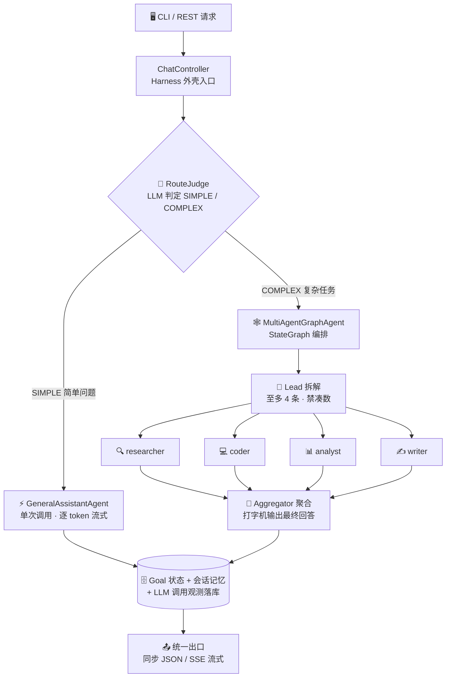
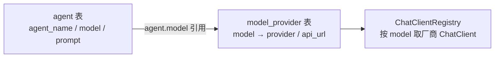

<div align="center">

# ☕ javaHarness

**基于 Spring AI 的 AI Agent 编排框架 —— 目标驱动的多 Agent 执行外壳**

[](https://openjdk.org/projects/jdk/17/)
[](https://spring.io/projects/spring-boot)
[](https://spring.io/projects/spring-ai)
[](https://github.com/alibaba/spring-ai-alibaba)
[](https://www.mysql.com/)
[](#-运行测试)
[](#-环境要求)

*简单问题直接答 · 复杂任务多 Agent 编排 · 全程流式可视化*

</div>

---

## 📑 目录

- [✨ 功能亮点](#-功能亮点)
- [🏗️ 架构总览](#%EF%B8%8F-架构总览)
- [🧰 技术栈](#-技术栈)
- [🚀 快速开始](#-快速开始)
- [🎮 CLI 使用](#-cli-使用)
- [🌐 REST 接口](#-rest-接口)
- [📡 SSE 流式协议](#-sse-流式协议)
- [🔁 断点续跑](#-断点续跑)
- [🔌 多模型与多服务商](#-多模型与多服务商)
- [📁 项目结构](#-项目结构)
- [🧪 运行测试](#-运行测试)
- [🙏 参考与致谢](#-参考与致谢)

## ✨ 功能亮点

| | 特性 | 说明 |
|---|---|---|
| 🧠 | **智能分流** | LLM 前置判断 SIMPLE / COMPLEX：闲聊问答直接答，复杂任务才进编排，不浪费 token |
| 🕸️ | **多 Agent 编排** | StateGraph「Lead 拆解 → 专家并行 → 聚合汇总」，按难度拆解（至多 4 条、禁凑数） |
| 👨‍👩‍👧‍👦 | **专家体系** | researcher / coder / analyst / writer 四类专家，数据库驱动配置，lead 按子任务智能指派 |
| 📺 | **真·流式输出** | 逐 token SSE 推送 + 打字机效果，编排各阶段实时进度事件（编排/拆解/子任务/聚合） |
| 🛡️ | **沙箱隔离** | 模型生成的代码/命令在 Docker 容器内执行，宿主机零暴露；工具按专家最小权限分配 |
| 💾 | **会话记忆** | 多轮上下文自动组装：过滤 / token 预算截断 / 角色归一化 |
| 🔁 | **断点续跑** | graph-core 检查点落库（MySQL），长编排中断后 `/resume` 从断点继续，已完成节点不重跑 |
| 🧮 | **调用观测** | 每次 LLM 调用落库：耗时 / token / 成败，可按会话查询 |
| 🖥️ | **Claude Code 风格 CLI** | spinner 原位刷新、工具调用行、回合小结，终端体验对标 Claude Code |

## 🏗️ 架构总览



> [!TIP]
> 数据流细节见 [`docs/data-flow.md`](./docs/data-flow.md)，落地 TODO 见 [`HARNESS_TODO.md`](./HARNESS_TODO.md)，测试全景见 [`docs/functional-testing.md`](./docs/functional-testing.md)。

## 🧰 技术栈

| 层面 | 技术 | 说明 |
|---|---|---|
| 🏛️ 框架 | Spring Boot 3.5.14 | 应用骨架、依赖注入、REST、自动配置 |
| 🤖 AI 接入 | Spring AI 1.1.4 + `spring-ai-starter-model-openai` | OpenAI 兼容协议接入多服务商（DashScope / DeepSeek），`Registry` 模式按 model 路由 |
| 🕸️ Graph 编排 | `spring-ai-alibaba-graph-core` 1.1.2.2 | StateGraph 多 Agent 编排 + 生命周期钩子进度推送 + 检查点断点续跑 |
| 📦 沙箱 | `spring-ai-alibaba-sandbox` 1.1.2.2 | 容器级工具执行隔离（agentscope-runtime）：Python/Shell/文件 + 浏览器，需本机 Docker |
| 🗄️ ORM | MyBatis-Plus 3.5.7 | `goal` / `session` / `session_messages` / `agent` / `model_provider` 等 CRUD |
| 🛫 Schema | Flyway | 启动自动执行迁移脚本，无需手动建表 |
| 🖥️ CLI | 自研 `ChatCli` + OkHttp 4.12 | 独立进程纯 HTTP 客户端，SSE 解析 + 终端渲染 |
| ✅ 校验 / JSON | Jakarta Validation / Jackson | 参数校验、DTO 序列化、SSE meta 解析 |
| 🛠️ 构建 | Maven（项目内仓库 `.mvn-repo`） | 见 [快速开始](#-快速开始) |

## 🚀 快速开始

### 📋 环境要求

| 依赖 | 必需 | 说明 |
|---|---|---|
| ☕ JDK | ✅ | 17+ |
| 🛠️ Maven | ✅ | 3.8+（项目自带 settings，无需全局额外配置） |
| 🗄️ MySQL | ✅ | `harness` 库，Flyway 启动自动建表 |
| 🐳 Docker Desktop | ⚠️ 沙箱必需 | Python/Shell/浏览器工具的容器隔离；无 Docker 时仅沙箱类工具不可用，其余功能正常（需预拉取镜像，见 `TECH_STACK.md`） |
| 🔑 API Key | 🔄 可选 | DashScope（通义千问）/ DeepSeek；不配置可启动，调用模型会返回 `invalid_api_key` |

### ⚡ 一键启动（Windows 推荐）

> [!TIP]
> 双击项目根目录的 **`run.bat`**，脚本自动：编译 → 打开主服务窗口（8080）→ 就绪后自动打开 CLI 聊天窗口。

### 🔧 手动启动

**1️⃣ 启动主服务**

```powershell
mvn -s .mvn/settings.xml spring-boot:run
```

**2️⃣ 另开终端，启动 CLI**

```powershell
mvn -s .mvn/settings.xml exec:java
```

**3️⃣ 或直接用 REST 聊天（无需 CLI）**

```bash
curl -s -X POST http://localhost:8080/api/chat \
  -H "Content-Type: application/json" \
  -d '{"message":"你好"}'
```

**4️⃣ （可选）配置真实 API Key**

```powershell
# Windows PowerShell
$env:QWEN_API_KEY = "sk-你的key"     # DashScope（通义千问）
$env:DEEPSEEK_API_KEY = "sk-你的key" # DeepSeek
```

重启服务后即可真实对话。

## 🎮 CLI 使用

CLI 是纯 HTTP 客户端（**不监听任何端口**），通过 REST 调用主服务：

```text
你> 你是谁
千问> 我是通义千问，一个AI助手...
```

| 命令 | 作用 |
|---|---|
| 直接输入文本 | 与当前 Agent（默认 general）聊天，多轮记忆自动延续 |
| `/new [名称]` | 🆕 新建会话并切换（旧会话保留） |
| `/agent <id>` | 🎭 切换到指定 Agent（agent 表主键）；`/agent` 查看当前；`/agent off` 恢复智能分流 |
| `/resume <goalId>` | 🔁 复杂编排断点续跑：从上次检查点继续（goalId 见每回合末尾会话信息） |
| `/help` / `/exit` | ❓ 帮助 / 🚪 退出 |

## 🌐 REST 接口

| 方法 | 路径 | 说明 |
|---|---|---|
| `POST` | `/api/chat` | 💬 同步聊天：`{"message":"你好","agentId":1}` |
| `POST` | `/api/chat/stream` | 📺 流式聊天（SSE）：同请求体，逐 token 推送 |
| `POST` | `/api/chat/resume?goalId=` | 🔁 复杂编排断点续跑，响应格式与 `/stream` 一致 |
| `GET` | `/api/harness/agents` | 🧩 已注册的 Agent 列表 |
| `GET` | `/api/harness/goals` | 🎯 目标（含聊天记录）与状态 |
| `GET` | `/api/harness/goals/{id}` | 🎯 查询单个目标状态 |
| `POST` | `/api/harness/submit?agent=general&objective=...` | 📤 提交一个异步目标 |
| `POST` | `/api/harness/sessions` | 🆕 新建会话（可选 `name`），返回 sessionId/name |
| `GET` | `/api/llm-calls?sessionId=&limit=` | 🧮 LLM 调用观测：耗时 / token / 成败（默认 50 条） |

> [!NOTE]
> `agentId` 可选（对应 agent 表主键）：为空走默认 Agent（general）。

## 📡 SSE 流式协议

响应 `Content-Type: text/event-stream`，事件流示例：

```text
event: progress
data: {"stage":"编排","detail":"开始拆解复杂目标…"}
event: progress
data: {"stage":"拆解","detail":"4 个子任务已就绪"}
event: token
data: 片段1
event: token
data: 片段2
...
data: [DONE]
event: meta
data: {"sessionId":"9","newSession":true,"goalId":null,"status":"SUCCEEDED","error":null}
```

| 事件 | 含义 |
|---|---|
| 📺 `event: token` | 模型生成的文本片段（逐 token 推送；行内换行已转义保证单行完整） |
| 📣 `event: progress` | 编排各阶段实时进度（编排/拆解/子任务完成/聚合），**不计入会话记忆** |
| 🏷️ `event: meta` | 回合末尾的会话信息：`sessionId` / `newSession` / `goalId` / `status`；失败时 `status=FAILED` 且追加 `error` |
| ⚠️ `event: error` | 流内错误信息 |

> [!IMPORTANT]
> - 每个 SSE 事件以单个元素成对输出（`event:`+`data:` 不会被其它事件交叉打断）
> - 全部推完发送 `[DONE]`
> - 可用 `curl -N` 观察逐段到达

## 🔁 断点续跑

复杂编排（COMPLEX 路径）基于 graph-core 检查点体系（`MysqlSaver` 自动建表落库，`threadId=goalId`）：

| 断开时机 | 续跑行为 |
|---|---|
| ✅ 编排已完整跑完 | 零 LLM 调用，直接回放最终回答 |
| ⏸️ 子任务批已完成、聚合中断 | 只补跑聚合（打字机输出），子任务结果复用 |
| ⏹️ 更早断开（如子任务批执行中） | 已完成节点不重跑，只补执行缺口 |
| 🚫 无任何检查点 | 快速失败：提示该 goal 未走过复杂路径 |

```bash
# API 方式
curl -N -X POST "http://localhost:8080/api/chat/resume?goalId=<goalId>"

# CLI 方式
/resume <goalId>
```

> [!NOTE]
> `goal` 不存在返回 400；仍在执行中返回 409；无检查点时流内发 `error` 事件。

## 🔌 多模型与多服务商

**数据库驱动的多 Agent + 多模型服务商**，接入手性零代码：



- 🧩 **Agent**（`agent` 表）：每行一个 Agent（`agent_name`/`model`/`prompt`）。种子行：`general`/`deepseek`（聊天）、`multi-agent`（编排器）、`lead`（拆解器）、`aggregator`（聚合器）、`researcher`/`coder`/`analyst`/`writer`（专家）
- 🗺️ **模型映射**（`model_provider` 表）：新增模型/服务商 = 加一行（`status=1`）重启即生效；`status=0` 禁用 → 回退默认 DashScope 客户端
- 🧭 **路由**：请求携带 `agentId` → 映射 `agentName` 路由；未命中回退默认 `general`

> [!TIP]
> **新增第三方供应商（如 Moonshot、OpenRouter）零代码**：
> 1. 设置环境变量 `MOONSHOT_API_KEY`（约定规则：`<PROVIDER大写>_API_KEY`）
> 2. `model_provider` 表加行：`INSERT INTO model_provider(model, provider, api_url, status) VALUES('kimi-k2','moonshot','https://api.moonshot.cn/v1',1);`
> 3. 重启生效
>
> 也可在 `application.yaml` 的 `app.providers.<provider>.api-key` 显式映射（优先级高于环境变量约定），现有环境变量名保持兼容。

> [!WARNING]
> API Key 出于安全不落库，解析规则（约定优于配置）：
> 1. `app.providers.<provider>.api-key`（yaml 显式映射，优先）
> 2. `<PROVIDER大写>_API_KEY` 环境变量（约定式回退，如 `QWEN_API_KEY`、`DEEPSEEK_API_KEY`）

## 📁 项目结构

采用经典分层架构（Controller → Service → Mapper/Entity），领域模型统一收纳在 `domain` 父包下：

<details>
<summary><b>📂 点击展开完整目录树</b></summary>

```text
src/main/java/com/dark/javaHarness/
├── JavaHarnessApplication.java   # Spring Boot 启动类（@MapperScan 指向 mapper 包）
├── controller/                   # 表现层：REST 接口 + SSE 流式
│   ├── ChatController.java       # 聊天接口（/api/chat、/api/chat/stream、/api/chat/resume）
│   ├── HarnessController.java    # 管理接口（agents / submit / goals / sessions）
│   └── LlmCallController.java    # LLM 调用观测查询（/api/llm-calls）
├── service/                      # 业务层（接口）
│   ├── AgentService.java         # Agent 编排：路由、执行目标、回写状态
│   ├── GoalService.java          # 目标生命周期管理
│   ├── SessionService.java       # 多轮会话记忆（session + session_messages）
│   ├── ChatService.java          # 聊天用例编排（同步 / 流式 / SSE / 断点续跑）
│   ├── RouteJudge.java           # 主 Agent 路由判断（SIMPLE / COMPLEX 分流）
│   ├── AgentConfigProvider.java  # 从 agent 表读取运行配置（路由映射）
│   └── impl/                     # 业务实现（AgentServiceImpl / ChatServiceImpl / LlmRouteJudge / LlmCallRecorder 等）
├── advisor/                      # Spring AI Advisor 拦截器（Agent 流程横切管理）
│   └── ContextAssemblingAdvisor.java  # 上下文组装：过滤/截断/role 归一化（token 预算）
├── config/agent/                 # Agent 配置与装配
│   ├── ChatAgentConfig.java      # 注册各 Agent bean + graph-core 检查点存储器（MysqlSaver）
│   ├── ChatClientFactory.java    # 按服务商构建 OpenAI 兼容 ChatClient（Registry 模式）
│   └── ChatClientRegistry.java   # 模型名 → ChatClient 注册表（从 model_provider 表加载）
├── mapper/                       # 数据访问层：MyBatis-Plus Mapper
│   └── AgentMapper / GoalMapper / SessionMapper / SessionMessageMapper / ModelProviderMapper / LlmCallLogMapper
├── domain/                       # 领域模型（父包）
│   ├── Goal.java                 # 目标 + 状态（PENDING/RUNNING/SUCCEEDED/FAILED）
│   ├── AgentConfig.java          # Agent 运行配置（model + prompt），来自 agent 表
│   ├── RouteDecision.java        # 路由决策枚举（SIMPLE / COMPLEX）
│   ├── LlmCallLog.java           # 一次 LLM 调用的观测记录（耗时/token/成败）
│   ├── dto/                      # 传输对象（ChatRequest/ChatResponse/SseMeta/分页等）
│   └── entity/                   # 数据库实体（对应 agent / goal / session / model_provider / llm_call_log 表）
├── enums/                        # 枚举与共享常量：GoalStatus、AgentConstants、SseProtocol
├── exception/                    # 全局异常处理（@RestControllerAdvice，统一 {code, message}）
├── agent/                        # Agent 抽象与实现
│   ├── Agent.java                # Agent 接口：name() / execute() / executeStreamReactive()
│   ├── GeneralAssistantAgent.java  # 路径 A：单次调用大模型（同步 call() / 真·逐 token stream()）
│   ├── MultiAgentGraphAgent.java   # 路径 B：StateGraph 编排（lead→并行子任务→聚合）+ 检查点断点续跑
│   ├── AgentChatCaller.java        # LLM 单次调用封装（查表配置 → 取客户端 → 组装 → 工具注入）
│   ├── BranchProgressListener.java # graph-core 生命周期钩子旁路（并行分支完成事件串行发射）
│   └── ProgressLine.java           # 进度行线协议（MARK+stage+SEP+detail）编解码
├── cli/
│   ├── ChatCli.java              # 命令行聊天客户端（独立进程，纯 HTTP 连 8080）
│   └── api/ChatApiClient.java    # OkHttp 封装 /api/chat 与 /api/chat/stream(SSE) / /api/chat/resume
└── tool/
    ├── WebTools.java             # 网页抓取工具（fetchUrl：HTML→纯文本，仅 http/https，限长）
    ├── DemoTools.java            # 示例工具集（时间 / 计算 / 天气）
    ├── SandboxToolProvider.java  # 容器级沙箱工具（Python/Shell/文件 + 浏览器，懒初始化、失败降级）
    └── ToolAssignments.java      # 工具分配表：按专家分配工具集（双通道注入，最小权限）
```

</details>

> [!NOTE]
> **分层职责**：`controller` 收发 REST/SSE，不承载业务逻辑；`service` 编排核心逻辑（接口与实现分离）；`mapper` / `domain.entity` 负责数据库读写与映射。

## 🧪 运行测试

单元测试基于 JUnit 5 + Mockito，**不依赖真实数据库 / 网络 / API Key**（当前 143 个用例全绿）：

```bash
mvn -s .mvn/settings.xml test
```

<details>
<summary><b>🔍 点击展开测试覆盖清单</b></summary>

| 测试 | 验证点 |
|---|---|
| `LlmRouteJudgeTest` | 🧭 主 Agent 分流判定：简单/复杂/异常 JSON 兜底 |
| `AgentServiceImplTest` | 🎭 多 Agent 路由：`agentId` → `writer` / 未命中回退 `general` |
| `AgentConfigProviderTest` | ⚙️ 从 `agent` 表读取配置（model / prompt）：命中、缺失、空白降级 |
| `ChatClientRegistryTest` | 🔌 多服务商：新增模型命中、禁用模型回退默认客户端 |
| `ChatControllerTest` | 🌐 Controller 层：流式 Flux 逐元素 + 换行、同步接口契约 |
| `ContextAssemblingAdvisorTest` | 💾 上下文组装：token 预算裁剪、role 归一化边界 |
| `ChatServiceImplTest` | 💬 多轮记忆、SSE 契约、resume 校验（400/409）与断点续跑委托 |
| `GeneralAssistantAgentTest` | ⚡ 路径 A：逐 token 渐进发射（防伪流式回归）、同步 execute |
| `MultiAgentGraphAgentTest` | 🕸️ 路径 B：编排闭环、进度时序（防死锁/丢事件）、专家派遣白名单、**断点续跑**（已完成节点不重跑 / 缺口补跑） |
| `ProgressLineTest` | 📣 进度线协议编解码 |
| `ToolAssignmentsTest` | 🛡️ 工具分配：双通道注入、最小权限、重名工具去重 |
| `McpToolProviderTest` | 🔗 MCP 工具接入：STDIO 传输、超时配置 |
| `WebToolsTest` | 🌍 网页抓取：HTML→纯文本、协议白名单 |

</details>

> [!WARNING]
> `JavaHarnessApplicationTests` 是 `@SpringBootTest`，会尝试连接本机 MySQL；无数据库环境下单独运行该类可能因连接失败报错（其余业务测试不受影响）。

## 🙏 参考与致谢

本项目的设计在以下优秀开源项目/产品的启发下完成，特此致谢：

| 参考 | 对应借鉴 |
|---|---|
| 🦌 [Deer-Flow](https://github.com/bytedance/deer-flow)（字节跳动） | 多 Agent 编排范式：「Coordinator → Planner 拆解 → 专家并行执行 → Reporter 汇总」架构与 researcher / coder / analyst / writer 专家角色划分，直接启发了本项目的 StateGraph 编排与专家 Agent 体系 |
| ⌨️ [Claude Code](https://github.com/anthropics/claude-code)（Anthropic） | CLI 终端体验：spinner 原位刷新 + 完成折叠归档、工具调用行（`⏺ 工具名(参数)` → `✓ 耗时`）、diff `+绿/-红` 着色、回合小结等交互设计（`TerminalRenderer`） |
| 🐳 [DeepSeek](https://github.com/deepseek-ai)（deepseek-ai） | Agent 工具库设计：网页抓取（fetchUrl）、文件/命令类工具的能力面划分，以及按 Agent 分配工具的最小权限思路 |

---

<div align="center">

**⭐ 如果这个项目对你有帮助，欢迎点个 Star！**

 Made with ☕ and ❤️ by javaHarness contributors

</div>
