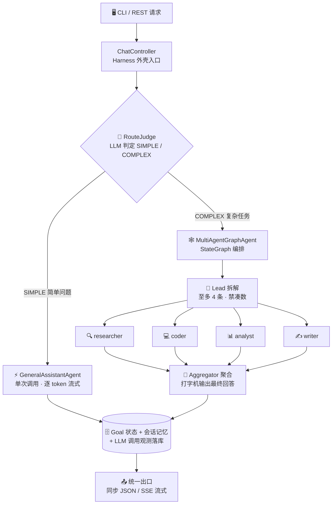
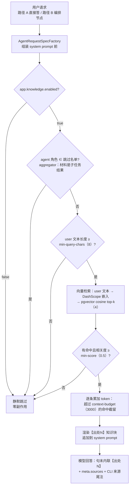
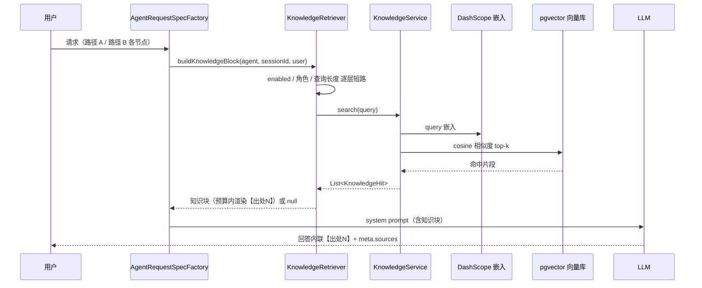
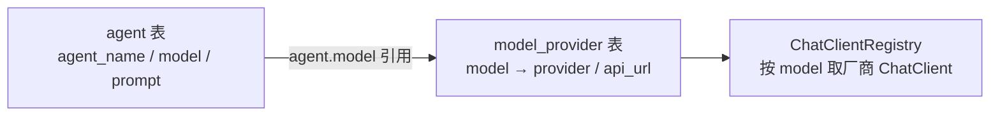

<div align="center">

[简体中文](README.md) | [English](README_EN.md)

</div>

<div align="center">

# ☕ javaHarness

**基于 Spring AI 的 AI Agent 编排框架 —— 目标驱动的多 Agent 执行外壳**

[](https://openjdk.org/projects/jdk/17/)
[](https://spring.io/projects/spring-boot)
[](https://spring.io/projects/spring-ai)
[](https://github.com/alibaba/spring-ai-alibaba)
[](https://www.mysql.com/)
[](#-运行测试)
[](#-环境要求)

*简单问题直接答 · 复杂任务多 Agent 编排 · 全程流式可视化*

</div>

---

## 📑 目录

- [✨ 功能亮点](#-功能亮点)
- [🏗️ 架构总览](#%EF%B8%8F-架构总览)
- [🧰 技术栈](#-技术栈)
- [🚀 快速开始](#-快速开始)
- [🎮 CLI 使用](#-cli-使用)
- [🌐 REST 接口](#-rest-接口)
- [📡 SSE 流式协议](#-sse-流式协议)
- [🔁 断点续跑](#-断点续跑)
- [🔌 多模型与多服务商](#-多模型与多服务商)
- [📁 项目结构](#-项目结构)
- [🧪 运行测试](#-运行测试)
- [🙏 参考与致谢](#-参考与致谢)

## ✨ 功能亮点

| | 特性 | 说明 |
|---|---|---|
| 🧠 | **智能分流** | LLM 前置判断 SIMPLE / COMPLEX：闲聊问答直接答，复杂任务才进编排，不浪费 token |
| 🕸️ | **多 Agent 编排** | StateGraph「Lead 拆解 → 专家并行 → 聚合汇总」，按难度拆解（至多 4 条、禁凑数） |
| 👨‍👩‍👧‍👦 | **专家体系** | researcher / coder / analyst / writer 四类专家，数据库驱动配置，lead 按子任务智能指派 |
| 📺 | **真·流式输出** | 逐 token SSE 推送 + 打字机效果，编排各阶段实时进度事件（编排/拆解/子任务/聚合） |
| 🧵 | **线程池治理** | 后台 Goal 走受管有界线程池（容量上限 + 队列满快速失败落 FAILED），流式派发独立池互不挤占 |
| 🛡️ | **沙箱隔离** | 模型生成的代码/命令在 Docker 容器内执行，宿主机零暴露；工具按专家最小权限分配 |
| 💾 | **会话记忆** | 多轮上下文自动组装：过滤 / token 预算截断 / 角色归一化 |
| 🔁 | **断点续跑** | graph-core 检查点落库（MySQL），长编排中断后 `/resume` 从断点继续，已完成节点不重跑 |
| 🧮 | **调用观测** | 每次 LLM 调用落库：耗时 / token / 成败，可按会话查询 |
| 📚 | **RAG 知识库** | knowledge/ 目录文档增量摄取（pgvector + DashScope 嵌入），路径 A/B 回答前检索注入，带【出处N】内联引用与来源尾注；PG 未就绪不影响启动 |
| 🖥️ | **Claude Code 风格 CLI** | spinner 原位刷新、工具调用行、回合小结，终端体验对标 Claude Code |

## 🏗️ 架构总览



> [!TIP]
> 数据流细节见 [`docs/data-flow.md`](./docs/data-flow.md)，落地 TODO 见 [`docs/HARNESS_TODO.md`](./docs/HARNESS_TODO.md)，测试全景见 [`docs/functional-testing.md`](./docs/functional-testing.md)。

## 🧰 技术栈

| 层面 | 技术 | 说明 |
|---|---|---|
| 🏛️ 框架 | Spring Boot 3.5.14 | 应用骨架、依赖注入、REST、自动配置 |
| 🤖 AI 接入 | Spring AI 1.1.4 + `spring-ai-starter-model-openai` | OpenAI 兼容协议接入多服务商（DashScope / DeepSeek），`Registry` 模式按 model 路由 |
| 🕸️ Graph 编排 | `spring-ai-alibaba-graph-core` 1.1.2.2 | StateGraph 多 Agent 编排 + 生命周期钩子进度推送 + 检查点断点续跑 |
| 📦 沙箱 | `spring-ai-alibaba-sandbox` 1.1.2.2 | 容器级工具执行隔离（agentscope-runtime）：Python/Shell/文件 + 浏览器，需本机 Docker |
| 🔌 MCP | `spring-ai-starter-mcp-client` + `server-webmvc`（SDK 锁定 0.17.0） | client 多 server 接入外部工具（懒连接 + 失败隔离）；server 以 Streamable-HTTP 暴露 `/mcp` 端点 |
| 📚 RAG | `spring-ai-pgvector-store` + PostgreSQL（pgvector）+ DashScope text-embedding-v4 | 知识库向量检索：增量摄取 + 路径 A/B 检索增强（可选依赖，PG 未就绪不影响启动） |
| 🗄️ ORM | MyBatis-Plus 3.5.7 | `goal` / `session` / `session_messages` / `agent` / `model_provider` 等 CRUD |
| 🛫 Schema | Flyway | 启动自动执行迁移脚本，无需手动建表 |
| 🖥️ CLI | 自研 `ChatCli` + OkHttp 4.12 | 独立进程纯 HTTP 客户端，SSE 解析 + 终端渲染 |
| ✅ 校验 / JSON | Jakarta Validation / Jackson | 参数校验、DTO 序列化、SSE meta 解析 |
| 🛠️ 构建 | Maven（项目内仓库 `.mvn-repo`） | 见 [快速开始](#-快速开始) |

## 🚀 快速开始

### 📋 环境要求

| 依赖 | 必需 | 说明 |
|---|---|---|
| ☕ JDK | ✅ | 17+ |
| 🛠️ Maven | ✅ | 3.8+（项目自带 settings，无需全局额外配置） |
| 🗄️ MySQL | ✅ | `harness` 库，Flyway 启动自动建表 |
| 🐳 Docker Desktop | ⚠️ 沙箱必需 | Python/Shell/浏览器工具的容器隔离；无 Docker 时仅沙箱类工具不可用，其余功能正常（需预拉取镜像，见 `docs/TECH_STACK.md`） |
| 🐘 PostgreSQL（pgvector） | 🔄 可选 | 仅 RAG 知识库使用：需启用 vector 扩展；未安装/未配置时应用照常启动，知识面为空 |
| 🔑 API Key | 🔄 可选 | DashScope（通义千问）/ DeepSeek；不配置可启动，调用模型会返回 `invalid_api_key` |

### ⚡ 一键启动

> [!TIP]
> 三套启动脚本任选其一（**勿同时运行**，8080 端口会冲突）：
> - **`run-wsl.bat`**（Windows 推荐）：双击自动进 WSL——编译 → 后台起服务（日志在 `/tmp/javaHarness-server.log`）→ 就绪后本窗口变 CLI
> - **`run.sh`**（WSL 终端）：`./run.sh` 全流程——编译 → 新窗口起服务 → 本终端轮询就绪 → 进入 CLI；子命令 `server / stop / cli / build / test`
> - **`run-win.bat`**（Windows 本机）：Windows 侧检出 + Windows JDK/Maven 环境时使用

### 🔧 手动启动

**1️⃣ 启动主服务**

```powershell
mvn -s .mvn/settings.xml spring-boot:run
```

**2️⃣ 另开终端，启动 CLI**

```powershell
mvn -s .mvn/settings.xml exec:java
```

**3️⃣ 或直接用 REST 聊天（无需 CLI）**

```bash
curl -s -X POST http://localhost:8080/api/chat \
  -H "Content-Type: application/json" \
  -d '{"message":"你好"}'
```

**4️⃣ （可选）配置真实 API Key**

按优先级任选其一，重启服务后即可真实对话（不配置也能启动，调用模型返回 401 占位 key 错误）：

```powershell
# 方式一：系统级环境变量（推荐，新开窗口全局生效；WSL 会话需 WSLENV 透传）
setx QWEN_API_KEY "sk-你的key"      # DashScope（通义千问）
setx DEEPSEEK_API_KEY "sk-你的key"  # DeepSeek
setx WSLENV "QWEN_API_KEY/u:DEEPSEEK_API_KEY/u"   # 透传进 WSL（Linux 侧运行时需要）

# 方式二：仓库根 .env.local（run.sh / run-wsl.bat 启动时自动加载，已被 gitignore 不入库）
#   QWEN_API_KEY=sk-你的key
#   DEEPSEEK_API_KEY=sk-你的key

# 方式三：仅当前终端会话临时生效
$env:QWEN_API_KEY = "sk-你的key"    # Windows PowerShell；WSL 用 export QWEN_API_KEY=...
```

## 🎮 CLI 使用

CLI 是纯 HTTP 客户端（**不监听任何端口**），通过 REST 调用主服务：

```text
你> 你是谁
千问> 我是通义千问，一个AI助手...
```

| 命令 | 作用 |
|---|---|
| 直接输入文本 | 与当前 Agent（默认 general）聊天，多轮记忆自动延续 |
| `/new [名称]` | 🆕 新建会话并切换（旧会话保留） |
| `/agent <id>` | 🎭 切换到指定 Agent（agent 表主键）；`/agent` 查看当前；`/agent off` 恢复智能分流 |
| `/resume <goalId>` | 🔁 复杂编排断点续跑：从上次检查点继续（goalId 见每回合末尾会话信息） |
| `/help` / `/exit` | ❓ 帮助 / 🚪 退出 |

## 🌐 REST 接口

| 方法 | 路径 | 说明 |
|---|---|---|
| `POST` | `/api/chat` | 💬 同步聊天：`{"message":"你好","agentId":1}` |
| `POST` | `/api/chat/stream` | 📺 流式聊天（SSE）：同请求体，逐 token 推送 |
| `POST` | `/api/chat/resume?goalId=` | 🔁 复杂编排断点续跑，响应格式与 `/stream` 一致 |
| `GET` | `/api/harness/agents` | 🧩 已注册的 Agent 列表 |
| `GET` | `/api/harness/goals` | 🎯 目标（含聊天记录）与状态 |
| `GET` | `/api/harness/goals/{id}` | 🎯 查询单个目标状态 |
| `POST` | `/api/harness/submit?agent=general&objective=...` | 📤 提交一个异步目标 |
| `POST` | `/api/harness/sessions` | 🆕 新建会话（可选 `name`），返回 sessionId/name |
| `GET` | `/api/llm-calls?sessionId=&limit=` | 🧮 LLM 调用观测：耗时 / token / 成败（默认 50 条） |
| `POST` | `/api/knowledge/sync` | 📚 知识库增量摄取：扫描 knowledge/ 目录，mtime 变更文档重嵌入，并清理磁盘已删文档的孤儿向量 |
| `GET` | `/api/knowledge/documents?page=&size=` | 📚 知识库摄取台账分页 |
| `GET` | `/api/knowledge/search?q=` | 📚 调试检索：向量检索命中片段与相关度（不注入 prompt） |
| `DELETE` | `/api/knowledge/documents/{name}` | 📚 删除指定知识文档（向量 chunk + 台账） |

> [!NOTE]
> `agentId` 可选（对应 agent 表主键）：为空走默认 Agent（general）。
> 知识库端点需 `app.knowledge.enabled=true`（默认 true）且配置好 pgvector/嵌入端点；未启用时返回 503。

### 📚 知识库问答（RAG）

把文档放进 `knowledge/` 目录（`.md` / `.txt`，支持 front-matter `title:`），摄取后路径 A/B 回答自动检索注入：

```bash
mkdir -p knowledge && cp 你的文档.md knowledge/
curl -X POST http://localhost:8080/api/knowledge/sync          # 增量摄取（只处理 mtime 变更的文档）
curl 'http://localhost:8080/api/knowledge/search?q=部署步骤'     # 调试检索看命中
```

回答中出现 `【出处N】` 内联引用时，CLI 回合末尾会打印「来源:」尾注；`meta.sources` / `ChatResponse.sources` 携带结构化出处（文档名/标题/相关度）。配置（top-k / 相似度阈值 / 注入预算等）见 `application.yaml` 的 `app.knowledge.*`。

#### 🗂️ 多知识库与 agent 绑定

`knowledge/` 的一级子目录即独立知识库（kb 标识），根目录散文档归公共库 `default`：

```bash
mkdir -p knowledge/java knowledge/frontend        # 一级子目录 = 知识库
cp spring.md knowledge/java/ && cp vue.md knowledge/frontend/
curl -X POST http://localhost:8080/api/knowledge/sync
```

在 `agent` 表 `knowledge` 列填写逗号分隔的 kb 标识（如 `java,frontend`）即可把 agent 绑定到指定知识库——检索时按向量 metadata 的 `kb` 字段过滤（`kb in [...]`），agent 只读绑定的库，防止读串；列留空/NULL 检索全部知识。文档在子目录间移动（kb 变更）会在下次 sync 自动重摄取补齐。

#### 🔍 RAG 触发逻辑

RAG 不是显式指令触发，而是**每次组装 prompt 前的旁路检查**——条件不满足全部静默降级，主链路零感知。

触发决策流程：



检索注入时序：



触发条件一览（全配置驱动，改 `application.yaml` 即调）：

| 触发条件 | 配置项 | 当前值 | 不满足时 |
|---|---|---|---|
| 知识库总开关 | `enabled` | true | 静默跳过 |
| 角色不在跳过名单 | ——（aggregator 策略跳过） | aggregator | 静默跳过 |
| 查询长度达标 | `min-query-chars` | 8 | 静默跳过 |
| 命中相关度达标 | `min-score` | 0.5 | 丢弃该命中 |
| 注入预算内 | `context-budget` | 3000 | 截留超预算命中 |

## 📡 SSE 流式协议

响应 `Content-Type: text/plain`（SSE 风格行协议，每个 Flux 元素独占一行，`event:` + `data:` 成对），事件流示例：

```text
event: progress
data: {"stage":"编排","detail":"开始拆解复杂目标…"}
event: progress
data: {"stage":"拆解","detail":"4 个子任务已就绪"}
event: token
data: 片段1
event: token
data: 片段2
...
data: [DONE]
event: meta
data: {"sessionId":"9","newSession":true,"goalId":null,"status":"SUCCEEDED","error":null}
```

| 事件 | 含义 |
|---|---|
| 📺 `event: token` | 模型生成的文本片段（逐 token 推送；行内换行已转义保证单行完整） |
| 📣 `event: progress` | 编排各阶段实时进度（编排/拆解/子任务完成/聚合），**不计入会话记忆** |
| 🏷️ `event: meta` | 回合末尾的会话信息：`sessionId` / `newSession` / `goalId` / `status`；失败时 `status=FAILED` 且追加 `error`；知识命中时携带 `sources`（文档名/标题/相关度） |
| ⚠️ `event: error` | 流内错误信息 |

> [!IMPORTANT]
> - 每个 SSE 事件以单个元素成对输出（`event:`+`data:` 不会被其它事件交叉打断）
> - 全部推完发送 `[DONE]`
> - 可用 `curl -N` 观察逐段到达

## 🔁 断点续跑

复杂编排（COMPLEX 路径）基于 graph-core 检查点体系（`MysqlSaver` 自动建表落库，`threadId=goalId`）：

| 断开时机 | 续跑行为 |
|---|---|
| ✅ 编排已完整跑完 | 零 LLM 调用，直接回放最终回答 |
| ⏸️ 子任务批已完成、聚合中断 | 只补跑聚合（打字机输出），子任务结果复用 |
| ⏹️ 更早断开（如子任务批执行中） | 已完成节点不重跑，只补执行缺口 |
| 🚫 无任何检查点 | 快速失败：提示该 goal 未走过复杂路径 |

```bash
# API 方式
curl -N -X POST "http://localhost:8080/api/chat/resume?goalId=<goalId>"

# CLI 方式
/resume <goalId>
```

> [!NOTE]
> `goal` 不存在返回 400；仍在执行中返回 409；无检查点时流内发 `error` 事件。

## 🔌 多模型与多服务商

**数据库驱动的多 Agent + 多模型服务商**，接入手性零代码：



- 🧩 **Agent**（`agent` 表）：每行一个 Agent（`agent_name`/`model`/`prompt`）。种子行：`general`/`deepseek`（聊天）、`multi-agent`（编排器）、`lead`（拆解器）、`aggregator`（聚合器）、`researcher`/`coder`/`analyst`/`writer`（专家）
- 🗺️ **模型映射**（`model_provider` 表）：新增模型/服务商 = 加一行（`status=1`）重启即生效；`status=0` 禁用 → 回退默认 DashScope 客户端
- 🧭 **路由**：请求携带 `agentId` → 映射 `agentName` 路由；未命中回退默认 `general`

> [!TIP]
> **新增第三方供应商（如 Moonshot、OpenRouter）零代码**：
> 1. 设置环境变量 `MOONSHOT_API_KEY`（约定规则：`<PROVIDER大写>_API_KEY`）
> 2. `model_provider` 表加行：`INSERT INTO model_provider(model, provider, api_url, status) VALUES('kimi-k2','moonshot','https://api.moonshot.cn/v1',1);`
> 3. 重启生效
>
> 也可在 `application.yaml` 的 `app.providers.<provider>.api-key` 显式映射（优先级高于环境变量约定），现有环境变量名保持兼容。

> [!WARNING]
> API Key 出于安全不落库，解析规则（约定优于配置）：
> 1. `app.providers.<provider>.api-key`（yaml 显式映射，优先）
> 2. `<PROVIDER大写>_API_KEY` 环境变量（约定式回退，如 `QWEN_API_KEY`、`DEEPSEEK_API_KEY`）
>
> Key 的**装载通道**：系统级环境变量（Windows 侧 + `WSLENV` 透传进 WSL）> 仓库根 `.env.local`（启动脚本自动 source，gitignored）> 当前会话 `export`；解析优先级不受通道影响。

## 📁 项目结构

采用经典分层架构（Controller → Service → Mapper/Entity），领域模型统一收纳在 `domain` 父包下：

<details>
<summary><b>📂 点击展开完整目录树</b></summary>

```text
src/main/java/com/dark/javaHarness/
├── JavaHarnessApplication.java   # Spring Boot 启动类（@MapperScan 指向 mapper 包）
├── controller/                   # 表现层：REST 接口 + SSE 流式
│   ├── ChatController.java       # 聊天接口（/api/chat、/stream、/resume、/goal-status）
│   ├── HarnessController.java    # 管理接口（agents / submit / goals / sessions / 会话绑定 Agent）
│   ├── ProviderAdminController.java  # 模型映射管理（/api/providers 查看与热刷新新增）
│   └── LlmCallController.java    # LLM 调用观测查询（/api/llm-calls）
├── service/                      # 业务层（接口 + impl/ 实现）
│   ├── AgentService / GoalService / SessionService / ChatService  # 编排、目标、会话记忆、聊天用例
│   ├── RouteJudge.java           # 主 Agent 路由判断（SIMPLE / COMPLEX 分流）
│   ├── AgentConfigProvider.java  # 从 agent 表读取运行配置（路由映射）
│   ├── ProviderAdminService.java # model_provider 映射管理（新增即热刷新注册表）
│   └── impl/                     # AgentServiceImpl / ChatServiceImpl / LlmRouteJudge / LlmCallRecorder 等
├── advisor/                      # Spring AI Advisor 拦截器（Agent 流程横切管理）
│   ├── ContextAssemblingAdvisor.java  # 上下文组装：过滤/token 预算截断/role 归一化
│   └── PromptBudgetAdvisor.java  # Prompt 分段预算（历史/user/工具结果三段裁剪）
├── config/                       # 应用配置
│   ├── GoalExecutorConfig.java   # 执行线程池：goal-exec- 后台 Goal 池 + mvc-async- MVC 异步槽位
│   ├── ContextBudgetProperties.java  # 上下文预算统一配置（app.context.*，yaml 为唯一数值源）
│   ├── KnowledgeProperties.java  # RAG 知识库配置载体（app.knowledge.*）
│   ├── KnowledgeConfig.java      # 知识库装配：向量库数据源/嵌入模型/PgVectorStore（条件装配+懒连接）
│   ├── PrimaryDataSourceConfig.java  # 主库（MySQL）显式声明（@Primary，多数据源下 Flyway/MyBatis 归属）
│   ├── MybatisPlusConfig.java    # MyBatis-Plus 分页等配置
│   └── agent/                    # Agent 配置与装配
│       ├── ChatAgentConfig.java  # 注册各 Agent bean + graph-core 检查点存储器（MysqlSaver）
│       ├── ChatClientFactory.java    # 按服务商构建 OpenAI 兼容 ChatClient（Registry 模式）
│       ├── ChatClientRegistry.java   # 模型名 → ChatClient 注册表（支持热刷新）
│       └── ThinkingSwitchChatModel.java  # 按 model_provider.disable_thinking 注入思考开关
├── prompt/                       # Prompt 组装管线（两路径统一）
│   ├── PromptAssembler.java      # 五段式 system prompt 组装（角色/工具索引/纪律/输出约定/skill）
│   ├── MemoryPolicy.java         # 会话记忆按角色注入矩阵
│   ├── SkillManager.java / SkillRepository.java  # Markdown 技能库动态装配（按需注入 system）
│   ├── ToolLazyManager.java      # 工具 Schema 两段式延迟加载（轻量索引 → expand_tool 展开）
│   └── PromptSection.java / SkillSectionProvider.java  # 段模型与 skill 扩展点
├── mapper/                       # 数据访问层：MyBatis-Plus Mapper
│   └── AgentMapper / GoalMapper / SessionMapper / SessionMessageMapper / ModelProviderMapper / LlmCallLogMapper
├── domain/                       # 领域模型（父包）
│   ├── Goal.java                 # 目标 + 状态（PENDING/RUNNING/SUCCEEDED/FAILED）
│   ├── AgentConfig.java          # Agent 运行配置（model + prompt），来自 agent 表
│   ├── RouteDecision.java        # 路由决策枚举（SIMPLE / COMPLEX）
│   ├── LlmCallLog.java           # 一次 LLM 调用的观测记录（耗时/token/成败）
│   ├── dto/                      # 传输对象（ChatRequest/ChatResponse/SseMeta/分页等）
│   └── entity/                   # 数据库实体（对应 agent / goal / session / model_provider / llm_call_log 表）
├── enums/                        # 枚举与共享常量：GoalStatus、AgentConstants、SseProtocol
├── exception/                    # 全局异常处理（@RestControllerAdvice，统一 {code, message}）
├── agent/                        # Agent 抽象、编排与 LLM 调用
│   ├── Agent.java / AgentRegistry.java    # Agent 接口与注册表
│   ├── GeneralAssistantAgent.java  # 路径 A：单模型对话（真·逐 token stream）
│   ├── MultiAgentGraphAgent.java   # 路径 B：StateGraph 编排门面（lead→并行子任务→聚合 + 断点续跑）
│   ├── AgentChatCaller.java        # LLM 调用封装（工具循环、幻觉工具容错、BudgetLedger 熔断记账）
│   ├── AgentRequestSpecFactory.java  # 两路径共用请求组装工厂（system/记忆注入/工具装饰/输出档位）
│   ├── LeadOutputParser.java       # lead 拆解 JSON 解析（子任务数 + 专家指派白名单）
│   ├── OrchestrationBudget.java    # 编排预算账本（AtomicLong 共享记账 + 降级说明）
│   ├── MultiAgentStreamPipeline.java  # 编排流式管道（进度行 → SSE 事件装配、续跑检查点选择）
│   ├── BranchProgressListener.java # graph-core 生命周期钩子旁路（并行分支完成事件串行发射）
│   ├── LlmRetry.java               # LLM 调用重试策略
│   └── ProgressLine.java           # 进度行线协议（MARK+stage+SEP+detail）编解码
├── knowledge/                    # RAG 知识库
│   ├── KnowledgeDocumentScanner.java  # 知识目录扫描（.md/.txt、front-matter 标题、坏文件跳过）
│   ├── MarkdownChunker.java      # 段落感知切分（~700 字符 + 重叠，纯函数）
│   ├── KnowledgeService(Impl).java  # 增量摄取（mtime 比对删旧写新）/ 删除 / 分页 / 检索
│   └── KnowledgeRetriever.java   # 检索注入器：user 文本→top-k 命中→【出处N】知识段（预算截断）
├── cli/                          # 命令行客户端（独立进程，纯 HTTP 连 8080）
│   ├── ChatCli.java              # 门面：main / chatLoop / 命令分发 / 回合执行
│   ├── ResumeStateStore.java     # /resume 续跑目标持久化（状态文件读写 + 宽容解析）
│   ├── input/TerminalInput.java  # 终端输入层：JLine 历史/补全/粘贴；无 TTY 降级行式读取
│   ├── api/ChatApiClient.java    # OkHttp 封装聊天/流式/续跑/供应商/会话接口（SSE 解析）
│   └── render/                   # Claude Code 风格渲染
│       ├── TerminalRenderer.java # 门面：流式增量直出 + spinner 折叠协作 + 工具调用行
│       ├── MarkdownAnsiRenderer.java / Ansi.java  # Markdown 行级 ANSI 着色
│       └── Spinner.java          # 阶段进度 spinner（原位刷新）
└── tool/                         # 工具层
    ├── WebTools.java             # 网页抓取门面（fetchUrl：抓取 + 30min 内容缓存 + 相关段落裁剪）
    ├── HtmlToMarkdown.java / ContentRelevance.java  # 噪声剔除/主内容 Markdown 化 / 按查询意图裁剪
    ├── SandboxToolProvider.java  # 容器级沙箱工具（Python/Shell/文件 + 浏览器，懒初始化、失败降级）
    ├── McpToolProvider.java / McpConfigParser.java  # MCP 工具接入（多 server 懒连接、失败隔离）/ mcp-config.json 解析
    ├── McpServerTools.java       # 内置 MCP Server 暴露的演示工具（Streamable-HTTP /mcp）
    ├── ToolAssignments.java      # 工具分配表：按专家分配工具集（双通道注入，最小权限）
    ├── ToolCallBudget.java / ToolCallTracer.java    # 工具次数/结果硬预算 / 调用起止进度行（装饰内核）
    ├── ToolCallbackDecorator.java / ToolDecorationContext.java  # 可插拔装饰器接口与上下文（Ordered 责任链）
    ├── ToolObservationDecorator.java / ToolBudgetDecorator.java / ToolLazyLoadDecorator.java / SkillMetaToolDecorator.java  # 默认装饰链四组件（观测100→预算200→懒加载300→元工具400）
    ├── DefaultToolDecorators.java  # 默认装饰链工厂（单一事实来源；新增装饰器=新类+此处登记一行）
    └── TokenEstimator.java       # 全项目统一 token 估算口径
```

</details>

> [!NOTE]
> **分层职责**：`controller` 收发 REST/SSE，不承载业务逻辑；`service` 编排核心逻辑（接口与实现分离）；`mapper` / `domain.entity` 负责数据库读写与映射。

## 🧪 运行测试

单元测试基于 JUnit 5 + Mockito，**不依赖真实数据库 / 网络 / API Key**（当前 327 个用例全绿）：

```bash
mvn -s .mvn/settings.xml test
```

<details>
<summary><b>🔍 点击展开测试覆盖清单</b></summary>

| 分组 | 测试 | 验证点 |
|---|---|---|
| 🧭 路由与会话 | `LlmRouteJudgeTest` `AgentServiceImplTest` `AgentConfigProviderTest` `SessionServiceImplTest` `GoalServiceImplTest` | SIMPLE/COMPLEX 分流与异常 JSON 兜底、多 Agent 路由与回退、会话与目标生命周期 |
| 🤖 Agent 调用 | `AgentChatCallerTest` `AgentChatCallerRetryTest` `LlmRetryTest` `GeneralAssistantAgentTest` | 工具循环与预算熔断记账、未知工具幻觉容错重试、重试策略、逐 token 渐进发射（防伪流式回归） |
| 🕸️ 编排 | `MultiAgentGraphAgentTest` `ProgressLineTest` | 编排闭环、进度时序（防死锁/丢事件）、专家派遣白名单、断点续跑（缺口补跑/回放）、**预算部分熔断降级**（剩余子任务跳过、聚合保留前序结果） |
| 🧩 Prompt 装配 | `PromptAssemblerTest` `MemoryPolicyTest` `SkillManagerTest` `SkillRepositoryTest` `ToolLazyManagerTest` | 五段式组装、记忆按角色注入矩阵、skill 动态装配、工具 Schema 两段式延迟加载 |
| 🎚️ 预算与观测 | `ContextBudgetPropertiesTest` `ContextAssemblingAdvisorTest` `PromptBudgetAdvisorTest` `ToolCallBudgetTest` `ToolCallTracerTest` `LlmCallRecorderTest` | yaml 绑定与 0=不限制口径、上下文/分段裁剪、工具次数与结果预算、调用起止进度行、落库观测 |
| 🔌 工具与 MCP | `WebToolsTest` `SandboxToolProviderTest` `McpToolProviderTest` `ToolAssignmentsTest` | HTML→Markdown 提取与协议白名单、沙箱懒初始化降级、MCP 多 server 配置解析、工具分配最小权限与去重 |
| 📚 知识库 RAG | `MarkdownChunkerTest` `KnowledgeDocumentScannerTest` `KnowledgeServiceImplTest` `KnowledgeRetrieverTest` | 段落感知切分与重叠续接、front-matter 解析与坏文件跳过、增量摄取/删除/分页/检索（mock VectorStore+Mapper）、角色跳过/预算截断/【出处N】渲染 |
| 🖥️ CLI | `TerminalRendererTest` `TerminalInputTest` `ResumeStateStoreTest` | Markdown 行级着色与流式增量直出（防整段重影回归）、无 TTY 降级输入、续跑状态读写往返 |
| 🌐 接口与基建 | `ChatControllerTest` `HarnessControllerTest` `ChatServiceImplTest` `GlobalExceptionHandlerTest` `ChatClientRegistryTest` `ChatClientFactoryTest` `ThinkingSwitchChatModelTest` `ProviderAdminServiceImplTest` `AgentRegistryTest` `ClientAbortLogFilterTest` `ModelQuotaExceptionTest` | REST 契约（流式逐元素/换行）、SSE 契约与 resume 校验（400/409）、异常统一 {code,message}、多服务商注册表与热刷新、思考开关 |

</details>

> [!WARNING]
> `JavaHarnessApplicationTests` 是 `@SpringBootTest`，会尝试连接本机 MySQL；无数据库环境下单独运行该类可能因连接失败报错（其余业务测试不受影响）。

## 🙏 参考与致谢

本项目的设计在以下优秀开源项目/产品的启发下完成，特此致谢：

| 参考 | 对应借鉴 |
|---|---|
| 🦌 [Deer-Flow](https://github.com/bytedance/deer-flow)（字节跳动） | 多 Agent 编排范式：「Coordinator → Planner 拆解 → 专家并行执行 → Reporter 汇总」架构与 researcher / coder / analyst / writer 专家角色划分，直接启发了本项目的 StateGraph 编排与专家 Agent 体系 |
| ⌨️ [Claude Code](https://github.com/anthropics/claude-code)（Anthropic） | CLI 终端体验：spinner 原位刷新 + 完成折叠归档、工具调用行（`⏺ 工具名(参数)` → `✓ 耗时`）、diff `+绿/-红` 着色、回合小结等交互设计（`TerminalRenderer`） |
| 🐳 [DeepSeek](https://github.com/deepseek-ai)（deepseek-ai） | Agent 工具库设计：网页抓取（fetchUrl）、文件/命令类工具的能力面划分，以及按 Agent 分配工具的最小权限思路 |

---

<div align="center">

**⭐ 如果这个项目对你有帮助，欢迎点个 Star！**

 Made with ☕ and ❤️ by javaHarness contributors

</div>

</div>
</div>
