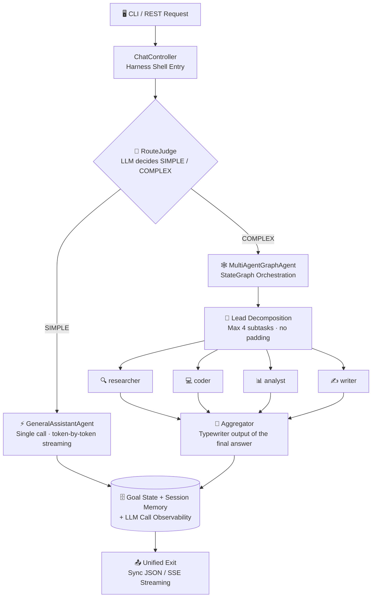
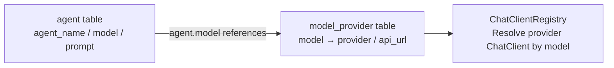

<div align="center">

[简体中文](README.md) | [English](README_EN.md)

</div>

<div align="center">

# ☕ javaHarness

**An AI Agent orchestration framework built on Spring AI — a goal-driven, multi-agent execution harness**

[](https://openjdk.org/projects/jdk/17/)
[](https://spring.io/projects/spring-boot)
[](https://spring.io/projects/spring-ai)
[](https://github.com/alibaba/spring-ai-alibaba)
[](https://www.mysql.com/)
[](#-running-tests)
[](#-prerequisites)

*Simple questions answered directly · Complex tasks orchestrated across agents · Fully streaming, end to end*

</div>

---

## 📑 Table of Contents

- [✨ Feature Highlights](#-feature-highlights)
- [🏗️ Architecture Overview](#%EF%B8%8F-architecture-overview)
- [🧰 Tech Stack](#-tech-stack)
- [🚀 Quick Start](#-quick-start)
- [🎮 CLI Usage](#-cli-usage)
- [🌐 REST API](#-rest-api)
- [📡 SSE Streaming Protocol](#-sse-streaming-protocol)
- [🔁 Resume from Checkpoint](#-resume-from-checkpoint)
- [🔌 Multi-Model & Multi-Provider](#-multi-model--multi-provider)
- [📁 Project Structure](#-project-structure)
- [🧪 Running Tests](#-running-tests)
- [🙏 References & Acknowledgements](#-references--acknowledgements)

## ✨ Feature Highlights

| | Feature | Description |
|---|---|---|
| 🧠 | **Smart Routing** | An upfront LLM judge decides SIMPLE / COMPLEX: small talk and Q&A get answered directly, only complex tasks enter orchestration — no wasted tokens |
| 🕸️ | **Multi-Agent Orchestration** | StateGraph "Lead decomposition → experts in parallel → aggregation"; subtasks are decomposed by difficulty (at most 4, no padding) |
| 👨‍👩‍👧‍👦 | **Expert System** | Four expert roles — researcher / coder / analyst / writer — configured from the database; lead assigns each subtask to the right expert |
| 📺 | **True Streaming** | Token-by-token SSE push with typewriter effect, plus real-time progress events for every orchestration stage (orchestration / decomposition / subtasks / aggregation) |
| 🛡️ | **Sandbox Isolation** | Model-generated code/commands run inside Docker containers with zero host exposure; tools are assigned per expert under least privilege |
| 💾 | **Session Memory** | Multi-turn context assembled automatically: filtering / token-budget truncation / role normalization |
| 🔁 | **Resume from Checkpoint** | graph-core checkpoints persisted to MySQL; after an interruption, `/resume` continues from the breakpoint without re-running completed nodes |
| 🧮 | **Call Observability** | Every LLM call is logged: latency / tokens / outcome, queryable per session |
| 🖥️ | **Claude Code-style CLI** | In-place spinner refresh, tool-call lines, turn summaries — a terminal experience modeled after Claude Code |

## 🏗️ Architecture Overview



> [!TIP]
> For data-flow details see [`docs/data-flow.md`](./docs/data-flow.md) (Chinese), for the roadmap see [`HARNESS_TODO.md`](./HARNESS_TODO.md) (Chinese), and for the full test landscape see [`docs/functional-testing.md`](./docs/functional-testing.md) (Chinese).

## 🧰 Tech Stack

| Layer | Technology | Description |
|---|---|---|
| 🏛️ Framework | Spring Boot 3.5.14 | Application skeleton, DI, REST, auto-configuration |
| 🤖 AI Access | Spring AI 1.1.4 + `spring-ai-starter-model-openai` | OpenAI-compatible access to multiple providers (DashScope / DeepSeek); `Registry` pattern routes by model |
| 🕸️ Graph Orchestration | `spring-ai-alibaba-graph-core` 1.1.2.2 | StateGraph multi-agent orchestration + lifecycle-hook progress events + checkpoint-based resumption |
| 📦 Sandbox | `spring-ai-alibaba-sandbox` 1.1.2.2 | Container-level tool execution isolation (agentscope-runtime): Python/Shell/file + browser; requires local Docker |
| 🗄️ ORM | MyBatis-Plus 3.5.7 | CRUD for `goal` / `session` / `session_messages` / `agent` / `model_provider` |
| 🛫 Schema | Flyway | Migrations run automatically at startup — no manual table creation |
| 🖥️ CLI | In-house `ChatCli` + OkHttp 4.12 | Standalone pure HTTP client process; SSE parsing + terminal rendering |
| ✅ Validation / JSON | Jakarta Validation / Jackson | Parameter validation, DTO serialization, SSE meta parsing |
| 🛠️ Build | Maven (in-project repo `.mvn-repo`) | See [Quick Start](#-quick-start) |

## 🚀 Quick Start

### 📋 Prerequisites

| Dependency | Required | Notes |
|---|---|---|
| ☕ JDK | ✅ | 17+ |
| 🛠️ Maven | ✅ | 3.8+ (in-project settings; no global configuration needed) |
| 🗄️ MySQL | ✅ | `harness` database; Flyway creates all tables at startup |
| 🐳 Docker Desktop | ⚠️ For sandbox | Container isolation for Python/Shell/browser tools; without Docker only sandbox-class tools are unavailable, everything else works (pre-pull images, see `TECH_STACK.md`) |
| 🔑 API Key | 🔄 Optional | DashScope (Qwen) / DeepSeek; the app starts without keys — model calls return `invalid_api_key` |

### ⚡ One-Click Start (recommended on Windows)

> [!TIP]
> Double-click **`run.bat`** in the project root. The script automatically: compiles → opens the main-service window (8080) → opens the CLI chat window once ready.

### 🔧 Manual Start

**1️⃣ Start the main service**

```powershell
mvn -s .mvn/settings.xml spring-boot:run
```

**2️⃣ In another terminal, start the CLI**

```powershell
mvn -s .mvn/settings.xml exec:java
```

**3️⃣ Or chat directly over REST (no CLI needed)**

```bash
curl -s -X POST http://localhost:8080/api/chat \
  -H "Content-Type: application/json" \
  -d '{"message":"你好"}'
```

**4️⃣ (Optional) Configure real API keys**

```powershell
# Windows PowerShell
$env:QWEN_API_KEY = "sk-your-key"     # DashScope (Qwen)
$env:DEEPSEEK_API_KEY = "sk-your-key" # DeepSeek
```

Restart the service and real conversations will work.

## 🎮 CLI Usage

The CLI is a pure HTTP client (**listens on no port**) and talks to the main service over REST:

```text
你> 你是谁
千问> 我是通义千问，一个AI助手...
```

| Command | Effect |
|---|---|
| Type any text | Chat with the current agent (general by default); multi-turn memory carries over |
| `/new [name]` | 🆕 Create a session and switch to it (the old one is kept) |
| `/agent <id>` | 🎭 Switch to an agent (primary key of the `agent` table); `/agent` shows current; `/agent off` restores smart routing |
| `/resume <goalId>` | 🔁 Resume an interrupted orchestration from its checkpoint (goalId appears in the session info at the end of each turn) |
| `/help` / `/exit` | ❓ Help / 🚪 Exit |

## 🌐 REST API

| Method | Path | Description |
|---|---|---|
| `POST` | `/api/chat` | 💬 Sync chat: `{"message":"你好","agentId":1}` |
| `POST` | `/api/chat/stream` | 📺 Streaming chat (SSE): same request body, token-by-token push |
| `POST` | `/api/chat/resume?goalId=` | 🔁 Resume an interrupted orchestration; response format identical to `/stream` |
| `GET` | `/api/harness/agents` | 🧩 Registered agents |
| `GET` | `/api/harness/goals` | 🎯 Goals (with chat records) and statuses |
| `GET` | `/api/harness/goals/{id}` | 🎯 Query a single goal's status |
| `POST` | `/api/harness/submit?agent=general&objective=...` | 📤 Submit an async goal |
| `POST` | `/api/harness/sessions` | 🆕 Create a session (optional `name`), returns sessionId/name |
| `GET` | `/api/llm-calls?sessionId=&limit=` | 🧮 LLM call observability: latency / tokens / outcome (default 50) |

> [!NOTE]
> `agentId` is optional (primary key of the `agent` table): when absent, the default agent (general) handles the request.

## 📡 SSE Streaming Protocol

Response `Content-Type: text/event-stream`. Example event stream:

```text
event: progress
data: {"stage":"编排","detail":"开始拆解复杂目标…"}
event: progress
data: {"stage":"拆解","detail":"4 个子任务已就绪"}
event: token
data: chunk-1
event: token
data: chunk-2
...
data: [DONE]
event: meta
data: {"sessionId":"9","newSession":true,"goalId":null,"status":"SUCCEEDED","error":null}
```

| Event | Meaning |
|---|---|
| 📺 `event: token` | Text chunks generated by the model (pushed token by token; in-line newlines are escaped so each event stays a single line) |
| 📣 `event: progress` | Real-time orchestration progress (orchestration / decomposition / subtask done / aggregation); **not** written into session memory |
| 🏷️ `event: meta` | Session info at the end of a turn: `sessionId` / `newSession` / `goalId` / `status`; on failure `status=FAILED` plus an `error` field |
| ⚠️ `event: error` | In-stream error message |

> [!IMPORTANT]
> - Each SSE event is emitted as a single atomic pair (`event:` + `data:` are never interleaved by other events)
> - `[DONE]` is sent after everything has been pushed
> - Use `curl -N` to watch chunks arrive one by one

## 🔁 Resume from Checkpoint

Complex orchestration (the COMPLEX path) is built on the graph-core checkpoint system (`MysqlSaver` creates and persists tables automatically, `threadId=goalId`):

| Interruption Point | Resume Behavior |
|---|---|
| ✅ Orchestration already finished | Zero LLM calls; the final answer is replayed directly |
| ⏸️ Subtask batch done, aggregation interrupted | Only aggregation re-runs (typewriter output); subtask results are reused |
| ⏹️ Earlier (e.g. mid subtask batch) | Completed nodes are not re-run; only the gap is executed |
| 🚫 No checkpoint at all | Fast fail: reports that the goal never went through the complex path |

```bash
# Via API
curl -N -X POST "http://localhost:8080/api/chat/resume?goalId=<goalId>"

# Via CLI
/resume <goalId>
```

> [!NOTE]
> Missing `goal` returns 400; still running returns 409; with no checkpoint an `error` event is emitted in-stream.

## 🔌 Multi-Model & Multi-Provider

**Database-driven multi-agent + multi-provider** — adding providers takes zero code:



- 🧩 **Agents** (`agent` table): one row per agent (`agent_name`/`model`/`prompt`). Seed rows: `general`/`deepseek` (chat), `multi-agent` (orchestrator), `lead` (decomposer), `aggregator`, and the experts `researcher`/`coder`/`analyst`/`writer`
- 🗺️ **Model mapping** (`model_provider` table): adding a model/provider = adding one row (`status=1`) and restarting; `status=0` disables it → falls back to the default DashScope client
- 🧭 **Routing**: a request carrying `agentId` maps to `agentName` for routing; misses fall back to the default `general`

> [!TIP]
> **Add a third-party provider (e.g. Moonshot, OpenRouter) with zero code**:
> 1. Set the environment variable `MOONSHOT_API_KEY` (convention: `<PROVIDER in upper case>_API_KEY`)
> 2. Add a row to `model_provider`: `INSERT INTO model_provider(model, provider, api_url, status) VALUES('kimi-k2','moonshot','https://api.moonshot.cn/v1',1);`
> 3. Restart to take effect
>
> Alternatively, map keys explicitly in `application.yaml` under `app.providers.<provider>.api-key` (takes priority over the environment-variable convention; existing variable names stay compatible).

> [!WARNING]
> For security, API keys are never stored in the database. Resolution rules (convention over configuration):
> 1. `app.providers.<provider>.api-key` (explicit yaml mapping, highest priority)
> 2. `<PROVIDER in upper case>_API_KEY` environment variable (fallback by convention, e.g. `QWEN_API_KEY`, `DEEPSEEK_API_KEY`)

## 📁 Project Structure

Classic layered architecture (Controller → Service → Mapper/Entity), with the domain model grouped under the `domain` parent package:

<details>
<summary><b>📂 Click to expand the full directory tree</b></summary>

```text
src/main/java/com/dark/javaHarness/
├── JavaHarnessApplication.java   # Spring Boot entry (@MapperScan points to the mapper package)
├── controller/                   # Presentation layer: REST endpoints + SSE streaming
│   ├── ChatController.java       # Chat endpoints (/api/chat, /api/chat/stream, /api/chat/resume)
│   ├── HarnessController.java    # Management endpoints (agents / submit / goals / sessions)
│   └── LlmCallController.java    # LLM call observability queries (/api/llm-calls)
├── service/                      # Business layer (interfaces)
│   ├── AgentService.java         # Agent orchestration: routing, goal execution, status write-back
│   ├── GoalService.java          # Goal lifecycle management
│   ├── SessionService.java       # Multi-turn session memory (session + session_messages)
│   ├── ChatService.java          # Chat use cases (sync / streaming / SSE / checkpoint resume)
│   ├── RouteJudge.java           # Main-agent routing decision (SIMPLE / COMPLEX)
│   ├── AgentConfigProvider.java  # Runtime config from the agent table (routing map)
│   └── impl/                     # Implementations (AgentServiceImpl / ChatServiceImpl / LlmRouteJudge / LlmCallRecorder etc.)
├── advisor/                      # Spring AI Advisor interceptors (cross-cutting agent-flow management)
│   └── ContextAssemblingAdvisor.java  # Context assembly: filter / truncate / role normalization (token budget)
├── config/agent/                 # Agent configuration & assembly
│   ├── ChatAgentConfig.java      # Registers agent beans + graph-core checkpoint store (MysqlSaver)
│   ├── ChatClientFactory.java    # Builds OpenAI-compatible ChatClients per provider (Registry pattern)
│   └── ChatClientRegistry.java   # Model-name → ChatClient registry (loaded from the model_provider table)
├── mapper/                       # Data access: MyBatis-Plus mappers
│   └── AgentMapper / GoalMapper / SessionMapper / SessionMessageMapper / ModelProviderMapper / LlmCallLogMapper
├── domain/                       # Domain model (parent package)
│   ├── Goal.java                 # Goal + status (PENDING/RUNNING/SUCCEEDED/FAILED)
│   ├── AgentConfig.java          # Agent runtime config (model + prompt), from the agent table
│   ├── RouteDecision.java        # Routing decision enum (SIMPLE / COMPLEX)
│   ├── LlmCallLog.java           # Observability record of one LLM call (latency/tokens/outcome)
│   ├── dto/                      # Transfer objects (ChatRequest/ChatResponse/SseMeta/pagination etc.)
│   └── entity/                   # DB entities (agent / goal / session / model_provider / llm_call_log tables)
├── enums/                        # Enums & shared constants: GoalStatus, AgentConstants, SseProtocol
├── exception/                    # Global exception handling (@RestControllerAdvice, uniform {code, message})
├── agent/                        # Agent abstractions & implementations
│   ├── Agent.java                # Agent interface: name() / execute() / executeStreamReactive()
│   ├── GeneralAssistantAgent.java  # Path A: single LLM call (sync call() / true token-by-token stream())
│   ├── MultiAgentGraphAgent.java   # Path B: StateGraph orchestration (lead → parallel subtasks → aggregation) + checkpoint resume
│   ├── AgentChatCaller.java        # Single LLM call wrapper (table config → client → assembly → tool injection)
│   ├── BranchProgressListener.java # graph-core lifecycle-hook sidecar (serializes parallel-branch completion events)
│   └── ProgressLine.java           # Progress line wire protocol (MARK+stage+SEP+detail) codec
├── cli/
│   ├── ChatCli.java              # CLI chat client (standalone process, pure HTTP to 8080)
│   └── api/ChatApiClient.java    # OkHttp wrapper for /api/chat, /api/chat/stream (SSE) and /api/chat/resume
└── tool/
    ├── WebTools.java             # Web fetch tool (fetchUrl: HTML → plain text, http/https only, size-capped)
    ├── DemoTools.java            # Demo toolset (time / calculator / weather)
    ├── SandboxToolProvider.java  # Container-level sandbox tools (Python/Shell/file + browser; bounded lazy init, graceful degradation)
    └── ToolAssignments.java      # Tool assignment table: per-expert toolsets (dual-channel injection, least privilege)
```

</details>

> [!NOTE]
> **Layer responsibilities**: `controller` handles REST/SSE and carries no business logic; `service` orchestrates the core logic (interfaces separated from implementations); `mapper` / `domain.entity` handle database reads, writes and mapping.

## 🧪 Running Tests

Unit tests run on JUnit 5 + Mockito and need **no real database / network / API keys** (currently 143 test cases, all green):

```bash
mvn -s .mvn/settings.xml test
```

<details>
<summary><b>🔍 Click to expand the test coverage list</b></summary>

| Test | What it verifies |
|---|---|
| `LlmRouteJudgeTest` | 🧭 Main-agent routing: simple / complex / malformed-JSON fallback |
| `AgentServiceImplTest` | 🎭 Multi-agent routing: `agentId` → `writer` / miss falls back to `general` |
| `AgentConfigProviderTest` | ⚙️ Config from the `agent` table (model / prompt): hit, missing, blank degradation |
| `ChatClientRegistryTest` | 🔌 Multi-provider: new model hits, disabled model falls back to the default client |
| `ChatControllerTest` | 🌐 Controller layer: streaming Flux element-by-element with newlines, sync API contract |
| `ContextAssemblingAdvisorTest` | 💾 Context assembly: token-budget trimming, role normalization edge cases |
| `ChatServiceImplTest` | 💬 Multi-turn memory, SSE contract, resume validation (400/409) and resume delegation |
| `GeneralAssistantAgentTest` | ⚡ Path A: progressive token emission (anti fake-streaming regression), sync execute |
| `MultiAgentGraphAgentTest` | 🕸️ Path B: orchestration closed loop, progress ordering (anti deadlock / lost events), expert dispatch whitelist, **checkpoint resume** (completed nodes not re-run / gaps filled) |
| `ProgressLineTest` | 📣 Progress line protocol codec |
| `ToolAssignmentsTest` | 🛡️ Tool assignment: dual-channel injection, least privilege, duplicate-tool dedup |
| `McpToolProviderTest` | 🔗 MCP tool access: STDIO transport, timeout configuration |
| `WebToolsTest` | 🌍 Web fetch: HTML → plain text, protocol whitelist |

</details>

> [!WARNING]
> `JavaHarnessApplicationTests` is a `@SpringBootTest` that tries to connect to local MySQL; running it standalone without a database may fail on connection (all other business tests are unaffected).

## 🙏 References & Acknowledgements

This project's design was inspired by the following excellent open-source projects/products — with thanks:

| Reference | What we borrowed |
|---|---|
| 🦌 [Deer-Flow](https://github.com/bytedance/deer-flow) (ByteDance) | The multi-agent orchestration paradigm — "Coordinator → Planner decomposition → experts in parallel → Reporter aggregation" and the researcher / coder / analyst / writer expert roles directly inspired this project's StateGraph orchestration and expert agent system |
| ⌨️ [Claude Code](https://github.com/anthropics/claude-code) (Anthropic) | The CLI terminal experience: in-place spinner refresh + collapsed completion archive, tool-call lines (`⏺ tool(args)` → `✓ duration`), diff `+green/-red` coloring, turn summaries and other interactions (`TerminalRenderer`) |
| 🐳 [DeepSeek](https://github.com/deepseek-ai) (deepseek-ai) | Agent toolset design: the capability split for web fetch (fetchUrl) and file/command tools, and the least-privilege idea of assigning tools per agent |

---

<div align="center">

**⭐ If this project helps you, please give it a Star!**

 Made with ☕ and ❤️ by javaHarness contributors

</div>
