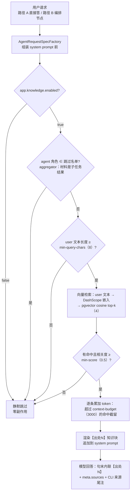
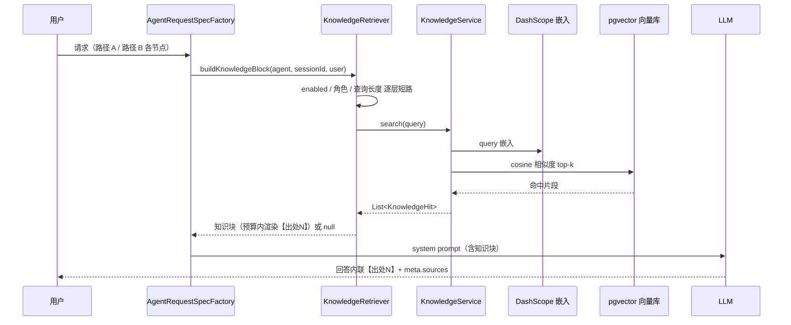

# Harness 数据流

> 本文档描述 Harness 的完整业务数据流：请求进入 → 会话加载 → 主 Agent 前置判断（路由分流）→ 两条路径执行 → 统一出口。
> 与「两路径架构」保持一致，以实际编码为准。

***

## 一、总览

```
用户请求 (message / sessionId / agentId)
        │
        ▼
① ChatController（Harness 外壳入口）
     /api/chat         → ChatService.chat()
     /api/chat/stream  → ChatService.streamReactive()
        │
② 加载会话原始数据 + 执行上下文组装
     sessionId → SessionService.loadContext() → 还原 Message 列表
     → 过滤/截断/角色归一化 → ContextAssemblingAdvisor（token 预算控制）
        │
③ 主 Agent 前置判断（路由分流）
     RouteJudge.judge(message) → LlmRouteJudge（一次 LLM 分类，失败兜底 SIMPLE）
        ├─ SIMPLE  → 路径 A：单次 LLM 调用（GeneralAssistantAgent）
        └─ COMPLEX → 路径 B：多 Agent 编排（MultiAgentGraphAgent + StateGraph）
        │
③' Agent 路由（表驱动动态注册）
     AgentServiceImpl.requireAgent(name) → AgentRegistry.require(name)
       注册表命中 → 直取实例；未命中 → 查 agent 表惰性注册（computeIfAbsent 原子构造）
       内部角色（is_internal=1）不注册；运行中插行免重启
        │
④ 统一出口：会话记忆写回 + 同步/SSE 响应（对外契约一致）

旁路：每次 LLM 调用（路由判断 / lead / 专家子任务 / 聚合 / 路径 A）结束
      → LlmCallRecorder 异步落库 llm_call_log（耗时 / token / 成败，见 5d 节）
```

***

## 1. 请求入口（Harness 外壳）

| 端点                      | 方法                                                         | 返回                                                      |
| ----------------------- | ---------------------------------------------------------- | ------------------------------------------------------- |
| `POST /api/chat`        | `ChatController.chat()`                                    | `ChatResponse`（JSON）                                    |
| `POST /api/chat/stream` | `ChatController.stream()` → `ChatService.streamReactive()` | `Flux<String>`（SSE：逐 token `data:` + `[DONE]` + `meta`） |

请求体 `ChatRequest`：`message`（必填）、`sessionId`（可选，空则建档）、`agentId`（可选）。

***

## 2. 同步路径 `/api/chat`

```
ChatService.chat(request)
  1. 无 sessionId → sessionService.createSession() 建档
  2. resolveAgent(message)                    ← 主 Agent 前置分流
       └─ routeJudge.judge(message) → COMPLEX → "multi-agent" / 否则 "general"
  3. agentService.executeSync(selectedAgent, message, sessionId)
       ├─ general（A）→ GeneralAssistantAgent.execute(goal)（薄适配）
       │     → AgentChatCaller.callWithAssembly()：按 agent 表 model 取 ChatClient（Registry）
       │       + MessageChatMemoryAdvisor 注入历史 + ContextAssemblingAdvisor 裁剪
       │       + 流式信道收集完整回复（唯一可中止通道）
       └─ multi-agent（B）→ MultiAgentGraphAgent.execute(goal)
             → StateGraph：lead 拆解 → 并行子任务 → 聚合 → 最终回答
  4. writeBackContext(sessionId, message, goal)
  5. 返回 ChatResponse {sessionId, newSession, goalId, status, summary}
```

***

## 3. 流式路径 `/api/chat/stream`

```
ChatService.streamReactive(request)
  1. resolveAgent(message)                    ← 主 Agent 分流（同步旁路）
  2. 无 sessionId → boundedElastic 上 createSession() 建档
  3. agent 选择：
       agentId 有值 → executeStreamReactiveByAgentId()
       无 agentId → 按 resolveAgent 结果：
         SIMPLE  → executeStreamReactive(general, ...)
         COMPLEX → executeStreamReactive(multi-agent, ...)
       └─ AgentService：create(sessionId) → markRunning → 订阅 Agent 流
  4. Flux 管道：data: token… → data: [DONE] → event: meta
       （多 Agent 复杂路径：进度行另作 event: progress + data:{stage,detail}；仅内容 token 计入写回摘要）
                 （出错改为 event:error + data:msg）
  5. doOnComplete → writeBackContext() 写回 session_memory（多轮记忆）
```

***

## 4. 主 Agent 前置判断（路由分流，核心薄环）

> 只做「分流」，不执行具体任务，保持入口薄；不改对外契约。

```
RouteJudge.judge(message)（接口）
   └─ LlmRouteJudge.judge(message)
       1. message 为空 → 直接 SIMPLE
       2. clientRegistry.get("route-judge") 取 ChatClient
       3. prompt.system(路由提示词).user(message).call()   ← 一次轻量 LLM
       4. 解析 JSON route：complex → COMPLEX，否则 → SIMPLE
       兜底（任何失败都 SIMPLE，「宁可简单」）：
           异常 / 超时 / 空 / 非 JSON → SIMPLE
```

**提示词**：模型只输出一行 `{"route":"simple"}` 或 `{"route":"complex"}`。

**分流点**：同步在建档后执行前；流式在 async 流开始前（旁路）。`resolveAgent()` 据此选执行体。

***

## 5. 会话与目标生命周期

| 阶段   | 动作                                                | 表                                   |
| ---- | ------------------------------------------------- | ----------------------------------- |
| 建档   | 无 sessionId → `createSession()`                   | `session`                           |
| 历史加载 | `ContextAssemblingAdvisor` + `MessageChatMemoryAdvisor` | 读 `session_messages` |
| 目标创建 | `AgentService` 执行 Goal，`markRunning()`            | `goal`                              |
| 执行   | 同步 `execute()` / 响应式 `stream()`                   | —                                   |
| 记忆写回 | 成功代表 UserMessage+AssistantMessage                 | 写 `session_messages`，`touchSession` |
| 完成   | `SUCCEEDED` / 失败 `FAILED`                         | `goal`                              |

阻塞 DB 操作置于 `Schedulers.boundedElastic()`，避免阻塞响应式循环。

***

## 5a. 上下文组装时序（会话加载 → 组装 → 调 LLM）

> `ContextAssemblingAdvisor` 只整理「已加载的历史 + 当前请求」。
> 编排路径同样生效：lead 节点经 `AgentChatCaller` + `MemoryPolicy` 以完全同构方式挂载本 advisor
> （编排里唯一注入会话记忆的角色，历史轮次同预算裁剪）；子任务/聚合不注入记忆、无历史可裁。
> 三层 token 控制分工（历史裁剪 / user 侧预算 / 工具结果预算）见 5f 节。

```
GeneralAssistantAgent.execute*(goal)
│  声明路径 A 装配差异 Assembly（恒记忆 / 无频率惩罚 / 无工具次数预算 / final 档输出封顶）
▼
AgentChatCaller.callWithAssembly / streamWithAssembly（执行层单一来源，路径 B 同引擎）
├─ AgentRequestSpecFactory.build（统一组装链）
├─ .advisors(MessageChatMemoryAdvisor.builder(memoryStore).build())
│       → 加载历史：memoryStore.get(conversationId=sessionId)
├─ .advisors(new ContextAssemblingAdvisor())
│        ① filterNoise()    丢弃空 / 空白 / 系统噪音
│        ② normalizeRoles()  system 置前；user/assistant 交替（连续同类保最后）
│        ③ trimToBudget()   token 估算，最旧丢弃（保 system），默认 ≤ 4000
├─ .system(prompt).user(objective)
│  请求 spec → 流式信道（唯一可中止通道）
▼
③ 调 LLM：阻塞收集（call） / 逐 token 发射（executeStreamReactive，管道核 tokenStream 同源）
```

**关键点**：① 职责解耦（加载 vs 整理）；②纯函数可单测；③保留 system + 最近；④ 同步/流式都覆盖。

***

## 5b. 路径 B 多 Agent 编排数据流（`MultiAgentGraphAgent`）

> `StateGraph`：「lead 拆解 → 并行子任务 → 聚合」，复杂请求（COMPLEX）执行体。流入 `{objective}`，流出 `final`。

```
MultiAgentGraphAgent.execute(goal)
│  构建 StateGraph（构造 compile，结构固定）
│    node：lead → subtask-0..3 → aggregate
│    边：START→lead →(fan-out)→ subtasks →(each)→ aggregate → END
│
│  invoke({objective})
│  ┌ lead 节点 ───────────────────────────┐
│  │  predictLead() → JSON {"subtasks":[…]} │
│  │  → 存 subtaskCount + subtask_0..n-1    │
│  └───────────────┬──────────────────────┘
│                  │ addEdge(lead, List(4)) 并行
│  ┌ subtask-0 ┐ ┌ subtask-1 ┐ … ┌ subtask-3 ┐
│  │ 调 LLM    │ │ 调 LLM    │     （lead 未设则短路）
│  │ → result_0 │ │ → result_1│     │           │
│  └─────┬─────┘ └─────┬─────┘     └─────┬─────┘
│        └─────────────┴─────────────┴─────┘
│                    ▼
│  ┌─ aggregate 节点 ────────────────┐
│  │ 收集 result_{i}（跳过空白），调 LLM │
│  │ → final                         │
│  └───────────────┬────────────────┘
│   invoke → value("final")（无则兜底返回 objective）
└── 统一出口：AgentService / ChatService 写回多轮记忆
```

**关键点**：① Lead 拆 ≤ `MAX_SUBTASKS=4`；② `addEdge(lead,List)` 并行；③ 复用 `ChatClientRegistry`；④ 输出 `final`。

**流式执行（`executeStreamReactive`：「主干帧 + 三条旁路」多通道）**：

> 动机：graph-core 的 `stream()` 按 superstep 吐帧，会把并行分支合并掉，「每个子任务何时完成」在主干里拿不到。
> 于是一路走主干帧覆盖能看到的节点，另一路挂 `GraphLifecycleListener` 补齐分支事件，最后 merge 成一条流。

```
MultiAgentGraphAgent.executeStreamReactive(goal)
│
│ ① 主干：CompiledGraph.stream({objective})（superstep 粒度）
│     START 帧      → 进度行「编排 开始拆解复杂目标…」
│     lead 帧       → 进度行「拆解 N 个子任务已就绪」
│     aggregate 帧  → 进度行「聚合 …」+ 内容行(final 最终回答)
│     END 帧        → （aggregate 已发内容则空，否则兜底 objective）
│         │ concatMap(toRows)
│         ▼
│ ② 旁路：BranchProgressListener（本次执行单独 compile 时注入 CompileConfig）
│     before(subtask-i)：进入节点的 state 含已布置的 subtask_i → 登记 scheduled
│     after (subtask-i)：登记命中才播报（lead 未布置的短路槽位静默，防虚假进度）
│         │ ProgressLine.encode("子任务", "第 i+1 个子任务完成")
│         │ tryEmitSerialized 加锁串行发射 ← 单播 Sink 拒绝并行线程并发发射
│         │   （FAIL_NON_SERIALIZED 会静默丢事件，踩坑记录）
│         ▼
│ ③ 旁路：聚合 token（liveTokens）——聚合节点流式调用逐 token 直推（含首个 token 前「聚合」进度行）
│
│ ④ 旁路：子任务工具事件（toolEvents）——子任务节点经 AgentChatCaller 注入「追踪版工具」
│     （ToolCallTracer 装饰 ToolCallback：schema 原样透传，仅 call 前后发事件）：
│       调用前 → ProgressLine.encode("tool", "WriteFile(/tmp/a.py)")
│       调用后 → ProgressLine.encode("tool-done", "WriteFile ✓ 1.2s · +12/-3 行")
│       （失败 → "WriteFile ✗ 0.3s"；diff 摘要从入参 old/new 串行数近似，仅文件写入/编辑类可得）
│     路径 A（GeneralAssistantAgent.executeStreamReactive）同样以旁路 sink 合并工具事件
│
│ ⑤ 合流：mainLine.mergeWith(branchEvents).mergeWith(liveTokens).mergeWith(toolEvents)
│     ⚠️ 关闸 doFinally(tryCompleteSerialized) 必须挂在 merge **之前**的主干段上：
│        merge 要求两源都终结才传 complete，关闸挂 merge 之后会循环等待 → 死锁（踩坑记录）
```

**行级线协议**（`ProgressLine`，跨组件统一格式）：

| 行类型 | 格式 |
| --- | --- |
| 进度行 | `\u0000stage\u0001detail`（首字符 MARK，非打印字符防撞内容） |
| 内容行 | 无前缀原文（token / 最终回答 final） |

**服务端 → CLI 转换（`ChatServiceImpl.streamReactive`）**：

| Agent 流出行 | SSE 输出 | 记忆写回 |
| --- | --- | --- |
| 进度行 | `event: progress` + `data: {"stage":..,"detail":..}`（Jackson 序列化 `StageRow` record） | 排除，不写回 |
| 内容行 | `data: <row>` | `doOnNext` 收集，`[DONE]` 后统一写回多轮记忆 |

CLI 解析到 `event: progress` 按阶段分派渲染：`编排/聚合` 转 spinner（原位刷新，完成折叠归档灰色 `✓ 阶段 · 耗时`）、`拆解/子任务` 直接归档摘要行、`tool` 转 `⏺ 工具名(参数)` spinner、`tool-done` 归档着色结果行（✓ 绿 / ✗ 红，`+N/-M 行` diff 着色）；`agent` 行（流首，detail=实际路由的 agent 名）供 CLI 在首个回答 token 前渲染「agentName> 」前缀，与用户侧「你> 」提示符对称；最终回答仍按内容流逐 token 呈现打字机效果——**增量直出**（只补打未上屏部分，不依赖终端擦行重绘；2026-09-06 修复：原每 token 整行擦除重绘在 `\r\033[2K` 失效终端表现为同段文字带渐长尾巴重复），仅有着色收益的行（标题/列表/粗体/行内代码/代码块）完成时才整行重绘升级。

**测试**：`MultiAgentGraphAgentTest`（mock Registry/ChatClient 固定返回，断言进度阶段时序与子任务事件数量）+ `ChatServiceImplTest.streamReactive_shouldMapProgressRowToProgressEvent` + `ToolCallTracerTest`（事件组装/装饰行为/schema 透传）+ `TerminalRendererTest`（工具行渲染）。

***

## 5c. 沙箱工具调用数据流（容器级隔离）

> 模型生成的代码/命令**只在 Docker 容器内执行，宿主机零暴露**（自研宿主机工具 FileTools/SearchTools/ShellTools 已「重合即退役」，无降级路径）。工具面由 `SandboxToolProvider`（agentscope-runtime）提供，`ToolAssignments` 按专家硬性分配。

```
专家子任务执行（coder / analyst / general / researcher）
│
① 工具注入（请求组装期，可插拔装饰链，默认链见 DefaultToolDecorators）
   AgentChatCaller.buildSpec()（两路径统一出口）
   → ToolAssignments.forAgent(专家名) → ToolSet{annotated(@Tool), callbacks(ToolCallback)}
   → AgentRequestSpecFactory 按 Order 升序应用装饰链（装饰器自判适用条件，不适用原样直通）：
   → 观测层 ToolObservationDecorator(100)：emitter/recorder 任一非空即装饰——调用前发 tool /
     调用后发 tool-done 进度行 + 异步落库 tool_call_log（无 SSE 链路的观测盲区由此覆盖；
     schema 原样透传，模型不可见差异）
   → 预算层 ToolBudgetDecorator(200)：单次调用内执行次数硬上限（tool-call-limit=8）+
     工具结果总量 token 预算（tool-result-budget=5000）——超限不再真执行，返回引导文本收束循环
   → 懒加载层 ToolLazyLoadDecorator(300)（最外层，会话级两段式）：未展开工具包轻量态（schema 置空、
     仅名称在 PromptAssembler 工具索引段可见）+ 追加 expand_tool 元工具（不经观测/预算——
     元工具不产生工具行噪声、不占真实执行额度）；模型先 expand 再正式调用
   → 元工具层 SkillMetaToolDecorator(400)：该 agent 有可见技能时追加 load_skill 元工具（同 expand_tool 口径）
   → spec.toolCallbacks(装饰后回调)
   ⚠️ 服务端硬边界：未分配的工具 schema 不出服务端，模型不可见也无执行注册
│
② 工具面来源（SandboxToolProvider，懒初始化仅一次）
   首次取用 → 双检锁 → SandboxService.start() + BaseSandbox
   → Docker 拉起容器（镜像 runtime-sandbox-base，容器 :80 → 宿主随机端口）
   → ToolkitInit 把容器能力包装为 12 个 ToolCallback，按安全类别三组：
       执行类×2（RunPythonCode / RunShellCommand）
       只读文件类×6（Read / ReadMultiple / ListDir / DirectoryTree / Search / FileInfo）
       写入类×4（Write / Edit / CreateDir / Move）
   （初始化失败 → 空工具面，warn 不重试，绝不回退宿主机执行）
│
③④ 模型侧循环（LLM tool-calling）
   请求（工具 schema + 任务描述）──────────▶ LLM
   ◀────────── tool_call {name, arguments} ─┐
   │                                         │
   ▼ ④ 服务端执行（Spring AI 框架）           │
   解析 tool_call → 匹配 ToolCallback → 调用   │
   → agentscope-runtime SDK ──HTTP──▶ 容器内 fastapi
                                       └─ 容器内执行 Python/Shell/文件操作（隔离文件系统）
   ◀── stdout / returncode / 文件内容 ──────┘
   → 执行结果作为 tool 消息回传 LLM（含失败也以模型可读文本回传）
│
⑤ 循环 ③④，直至 LLM 不再发起 tool_call → 产出最终回答
```

**专家分配表**（`ToolAssignments`，最小权限）：

| 专家 | @Tool 对象 | Sandbox ToolCallback | MCP ToolCallback |
| --- | --- | --- | --- |
| researcher | WebTool（轻量静态抓取：jsoup 解析 + 主内容提取 + Markdown 输出，沙箱未覆盖） | 只读文件类 | 是（见 5e 节，扩展工具生态） |
| coder | — | 执行类 + 写入类（读→改→跑验证闭环） | — |
| analyst | — | 执行类 + 只读类 | — |
| general | WebTool | 全量 | 是（见 5e 节） |
| writer / 未登记（含 lead、aggregator、multi-agent） | — | 空集（不触发沙箱初始化） | — |

**关键点**：① 模型生成的代码/命令只落容器，宿主机零暴露；② 空集专家完全不触碰 Docker；③ 容器随 `@PreDestroy` 释放（`SandboxService.close()`），宿主机无残留；④ 执行失败包装为模型可读文本回传，由模型自行调整重试。

**测试**：`ToolAssignmentsTest`（双通道分配语义、EMPTY 不触发沙箱初始化）+ JShell 直连真实验证（容器拉起 → 容器内 Shell returncode=0 → 退出自动删容器，见 `docs/reports/2026-08-28-sandbox-integration.md`）。

***

## 5d. LLM 调用观测数据流（成本账本）

> 每次真实 LLM 调用结束后，把「耗时 / token / 成败」异步写 `llm_call_log` 表——账本性质，与主链路解耦：观测失败绝不影响调用本身。

```
LLM 调用出口（五类调用点统一收敛）
│  ① LlmRouteJudge.judge()          路由判断（阻塞 RestClient，token 取响应 Usage 真实值）
│  ② MultiAgentGraphAgent.lead()    lead 拆解（经 AgentChatCaller.call）
│  ③ MultiAgentGraphAgent 子任务     专家执行（经 AgentChatCaller.call，工具调用不单独记账）
│  ④ MultiAgentGraphAgent 聚合      AgentChatCaller.stream（逐 token 收集后估算）
│  ⑤ GeneralAssistantAgent          路径 A（经 callWithAssembly/streamWithAssembly；
│                                    响应式链 executeStreamReactive 自挂终结钩子记录）
│
▼ AgentChatCaller / GeneralAssistantAgent / LlmRouteJudge 埋点
   调用前记 start；成功解析 Usage（真实 token）/ 失败取异常消息
        │
        ▼ LlmCallRecorder.record(LlmCallLog)          ← 旁路，boundedElastic 异步
   落库 llm_call_log：session_id / agent_name / model /
   call_kind(SYNC|STREAM) / status(OK|ERROR) /
   prompt_tokens / completion_tokens / total_tokens /
   tokens_estimated(1=按输出文本近似估算) /
   duration_ms / error_msg / created_at
   （落库失败仅 warn，不重试不阻塞主链路）
        │
        ▼ 查询：GET /api/llm-calls?sessionId=&limit=（LlmCallController，按 id 倒序）
```

**关键点**：① 全部调用点收敛埋点（路径 A/B + 路由判断全覆盖）；② 异步旁路（主链路零等待）；
③ token 两个口径——**仅 LlmRouteJudge 阻塞调用**取响应 `Usage` 真实值（prompt/completion 均有）；
其余调用经 `AgentChatCaller` 流式背书（2026-09 取消改造，流式是唯一可中止通道），流式响应
未开 usage 回传 → `prompt_tokens=null`、`completion_tokens` 按输出文本近似估算
（中文 1 token、其它 (长度+3)/4，与 `ContextAssemblingAdvisor` 同口径）；④ 每次调用只查一次 agent 表（观测的 model 与请求组装共用）。

**与 Micrometer Tracing 的关系**：本表是成本账本（SQL 可聚合按角色/会话统计花费）；Tracing 是性能显微镜（单次请求耗时瀑布），互补不互替（Tracing 见 TODO「完整链路追踪」）。

**测试**：`LlmCallRecorderTest`（估算口径 / 异步落库 / 落库失败不影响调用方）。

***

## 5e. MCP 工具接入数据流（进程内 server ↔ client 闭环）

> 通过 Model Context Protocol（MCP）把工具标准化注入 tool-calling 生态。当前为「自建 + 同进程闭环」架构：
> 本应用既作为 **MCP Server**（`McpServerTools` 暴露工具至 `/mcp` 端点），也作为 **MCP Client**
> （`McpToolProvider` 经 `/mcp` 发现工具），全流程 HTTP/Streamable 传输，无需外部服务。

```
① MCP Server（本进程，Streamable-HTTP 传输）
   McpServerTools（@Component，3 个 @Tool 演示工具：sum / greet / today）
     └─ 内嵌 @Configuration 声明 ToolCallbackProvider bean（mcpServerToolsProvider）
           → 把 @Tool 方法转成 MCP tool 规范
     └─ spring.ai.mcp.server.protocol=STREAMABLE + streamable-http.mcp-endpoint=/mcp
        → McpServerAutoConfiguration 注册端点：tools/list 列出 3 个工具，
          tools/call 由 bean 分派执行并回传结果（日志 "Registered tools: 3"）
        （protocol 若为默认 SSE，端点不在 /mcp → 客户端连不上，必须显式置 STREAMABLE）

② MCP Client（懒连接 + 失败降级，架构与 SandboxToolProvider 同源）
   McpToolProvider.toolCallbacks()
     ├─ 已缓存 → 直接返回（单例，只连一次）
     ├─ server-url 为空 → warn + 返回空工具面（不发起连接）
     └─ 首次取用 → 双检锁 → HttpClientStreamableHttpTransport(url)
          → McpSyncClient（request/initialization 超时）→ SyncMcpToolCallbackProvider
          → 4 端内建 /mcp 工具（连接/发现失败 → warn + 空工具面，绝不抛异常拖垮应用）
   ⚠️ client 与 server 同进程：须待 Spring 启动完成 /mcp 才可达，懒连接天然规避启动死锁

③ 分配（ToolAssignments，硬边界）
   only researcher: mcp.toolCallbacks() 注入其 ToolSet.callbacks
   其他专家/编写者（含 lead、aggregator、multi-agent）不注入 MCP 工具 schema，
   未分配工具模型不可见、服务端也无执行注册

④ 模型侧循环（与 5c③④ 完全同构，由 Spring AI tool-calling 统一驱动）
   请求（含 MCP 工具 schema）──▶ LLM
   ◀── tool_call {name, arguments} ┐
   ▼ 执行：解析 tool_call → 匹配 MCP ToolCallback → McpClient 调 /mcp → tools/call
   ◀── 工具结果 ──┘ 转为 tool 消息回传 LLM → 循环直至产出最终回答
```

**专家分配表**（`ToolAssignments`，最小权限）：

| 专家 | 是否注入 MCP 工具 | 说明 |
| --- | --- | --- |
| researcher | 是 | 探索者，MCP 工具并入其工具面 |
| general | 是 | 全量（执行 + 读写 + 检索 + 网页 + 浏览器 + MCP 工具） |
| coder | 否 | — |
| analyst | 否 | — |
| writer / 未登记（multi-agent） | 否 | 空集 |

**关键点**：① server 与 client 同进程，端点 `/mcp` 由 STREAMABLE 协议提供；② client 懒连接 + 失败降级，未配置/连不上返回空工具面，不影响主链路启动；③ 单例缓存一次连接，后续取用零重复握手；④ 由 `ToolAssignments` 硬性分配（当前 researcher 与 general），未分配 agent 不可见不可调。

**测试**：`McpToolProviderTest`（未配置→空 / 空白→空 / 不可达→空且不抛错 / 连上运行中 `/mcp`→发现 3 工具 sum/greet/today）+ `ToolAssignmentsTest`（researcher/general 得 MCP 工具，其余 agent 不得）+ 手动 HTTP 验证（initialize → tools/list → tools/call sum(3,5) 得 sum=8）。

***

## 5f. Prompt 组装与上下文注入数据流（prompt 包）

> 两路径统一的 system prompt 组装管线（`PromptAssembler`）+ 会话记忆按角色注入（`MemoryPolicy`）
> + 思考开关动态注入（`ThinkingSwitchChatModel`）。一次 LLM 请求的上下文 = 四部分：
> system（五段式）+ 工具 schema（三层装饰后）+ messages（记忆 + 当前输入）+ options（模型参数）。

```
AgentChatCaller.buildSpec()（统一出口）
│
① system prompt：PromptAssembler.assemble(agentName, roleFallback)
   五段式（按 order 排序、空段跳过、空行分隔）：
     1 角色段   → agent 表行 prompt > 调用方兜底 roleFallback（lead/aggregator 兜底词、
                  子任务专家 persona）> 默认「执行任务的 AI 助手」
     2 工具索引段 → ToolAssignments 用途元数据（名称：用途，仅本 agent 分配面）；
                  lazy 开启时追加 expand_tool 使用引导（与 5c 第三层联动）
     3 工具纪律段 → 网络类合计 ≤8 次 / 同 URL 只抓一次 / 材料够立即停止（提示词软约束，
                  真正兜底是 5c 第二层 8 次硬上限）
     4 输出约定段 → 「直接给出完成结果」
     5 skill 段  → SkillSectionProvider 扩展点（当前无实现输出空，预留子项 1）
│
② messages：MemoryPolicy 按角色注入会话记忆（同一 memoryStore，经 ContextAssemblingAdvisor
   同预算裁剪，与路径 A general 完全同口径）
     - 注入：路径 A general / 编排 lead（拆解需要理解多轮指代）
     - 不注入：aggregator（忠实汇总子任务结果，不掺对话）、子任务专家、route-judge
     - 无会话 ID 自动跳过（无记忆场景零开销）
│
③ options：模型参数注入
     - model ← agent 行配置（经 AgentRegistry/ChatClientRegistry）
     - frequencyPenalty=0.5（编排调用，抑制复读）
     - enable_thinking:false ← ThinkingSwitchChatModel 包装器按 model_provider.disable_thinking
       字段动态注入（模型层实现，dashscope 思考型模型单轮推理分钟级 → 秒级）
```

**关键点**：① 组装管线两路径统一（编排节点硬编码 persona/纪律拼接已删除）；② 记忆注入策略
集中一处（MemoryPolicy 一个类改策略）；③ skill 段为后续「skill 动态装配」预留接缝。

**测试**：`PromptAssemblerTest`（段序/来源优先级/空段跳过）+ `MemoryPolicyTest`（角色矩阵）+ `ToolLazyManagerTest`（两段式/自愈）。

***

## 5g. Agent 表驱动自动注册与路由（AgentRegistry）

> Agent 注册口径从「bean + 表行」收敛为「agent 表一行」：注册一个新 Agent = 插一行数据，
> 无需改代码、无需重启。`is_internal=1`（multi-agent/lead/aggregator）标记内部编排角色。

```
启动期
   AgentConfigProvider.listAgentNames()（只返回 is_internal=0 的对话行）
     → AgentRegistry 注册全部对话 Agent（构造 Agent + ChatClient 失败 → fail-safe 跳过该行，
       warn 不拖垮启动；general 缺行 → 代码兜底注册，DB 优先不合并）

请求期（AgentServiceImpl.requireAgent / getAgentConfig）
   注册表命中 → 直取实例（零 DB 查询）
   未命中（如 CLI /agent 切到新插入的 nailong）
     → 查表惰性注册：ConcurrentHashMap.computeIfAbsent 原子构造（并发请求只构造一次）
     → 表中无该行 → 抛「未知 Agent」（CLI 展示可用列表）
     ⚠️ 运行中插行即生效（免重启），查表仅依赖 Dao 层，无循环依赖
```

**关键点**：① 单一事实来源（agent 表）；② internal 标记避免编排角色被对话路由选中；
③ fail-safe（脏行不影响其它 Agent 与启动）；④ 兜底语义明确（general 代码兜底仅缺行时，两来源不合并）。

**测试**：`AgentRegistryTest`（自动注册/惰性热注册/internal 排除/兜底/脏数据跳过）+ `AgentServiceImplTest` 适配。

***

## 5h. Goal 执行通道与线程池治理（2026-09-06）

> Goal 有三条执行通道，线程归属各不相同；后台执行走受管线程池，不再占用
> `ForkJoinPool.commonPool()`（CPU-1 线程且被并行流等 JVM 全局共用，分钟级阻塞
> LLM 调用占满会拖累无关代码）。

```
① 同步通道 executeSync
   Tomcat 请求线程内直接阻塞执行 run()（调用方要的就是同步语义）

② 异步通道 submit（POST /api/harness/submit）
   goalService.create（PENDING 落库）→ goalExecutor.execute(() -> run(goal, agent))
   → 池内线程：markRunning → agent.execute（阻塞 LLM 调用）→ SUCCEEDED/FAILED 落库
   客户端轮询 GET /api/harness/goals/{id} 取终态
   ⚠️ 拒绝兜底：池满（8 在途 + 50 队列满）时 execute 抛 RejectedExecutionException
      → submit 捕获 → goal.fail("执行队列已满…") 落库（终态可见，不留无声排队 PENDING）
   ⚠️ run() catch Throwable：Error 逃逸也回写 FAILED，goal 不再永久卡 RUNNING

③ 流式通道 executeStreamReactive / resume
   MVC 异步请求处理（Flux→SSE 桥接的完成/超时派发）走 applicationTaskExecutor 槽位
   （mvc-async- 前缀池，Boot 按 bean 名接线）
   业务侧阻塞 DB / Agent 执行 → Schedulers.boundedElastic()（Reactor 自带池）
```

**线程池配置**（`GoalExecutorConfig`，两池分离互不挤占）：

| 池 | bean 名 | 参数 | 承载 |
| --- | --- | --- | --- |
| goal 执行池 | `goalExecutor` | core=max=8 / 队列 50 / 前缀 `goal-exec-` / 优雅停机 30s | 后台 Goal（分钟级阻塞 LLM 调用，线程数=最大并发编排数） |
| MVC 异步槽位 | `applicationTaskExecutor` | core=8 / 前缀 `mvc-async-` / 默认无界队列 | 流式 SSE 的结果/超时派发（任务短小） |

⚠️ **Boot 槽位坑**：项目定义任意 `Executor` bean 会让 Boot 自动配置的 applicationTaskExecutor
让位（`@ConditionalOnMissingBean(Executor.class)`），而 MVC 异步按 bean 名
`containsBean("applicationTaskExecutor")` 接线——槽位缺席时流式请求回退为
**每请求开新线程**的 `MvcSimpleAsyncTaskExecutor`（无界）并打生产告警（static 闸每 JVM
只打一次，易漏）。故两个池必须成对显式定义。

**单实例假设**：启动清理 `failAllRunning`（RUNNING → FAILED）与本地线程池都基于单实例
部署；水平扩展需先解除该假设（见 TODO「多实例水平扩展」）。

**测试**：`AgentServiceImplTest`（10 并发 submit 全 SUCCEEDED / 队列满拒绝兜底落 FAILED / LinkageError 逃逸回写 FAILED）。

***

## 5i. RAG 知识检索注入数据流（prompt 组装前旁路）

RAG 不是显式指令触发，而是**每次组装 prompt 前的旁路检查**——条件不满足全部静默降级，
主链路零感知（入口用法与多知识库绑定见 README「知识库问答」节）。

触发决策流程：



检索注入时序：



触发条件一览（全配置驱动，改 `application.yaml` 即调）：

| 触发条件 | 配置项 | 当前值 | 不满足时 |
|---|---|---|---|
| 知识库总开关 | `enabled` | true | 静默跳过 |
| 角色不在跳过名单 | ——（aggregator 策略跳过） | aggregator | 静默跳过 |
| 查询长度达标 | `min-query-chars` | 8 | 静默跳过 |
| 命中相关度达标 | `min-score` | 0.5 | 丢弃该命中 |
| 注入预算内 | `context-budget` | 3000 | 截留超预算命中 |

**测试**：`KnowledgeRetrieverTest`（角色跳过/预算截断/【出处N】渲染）、`KnowledgeServiceImplTest`（增量摄取/删除/分页/检索）。

***

## 6. 错误处理

| 环节             | 处理                                        |
| -------------- | ----------------------------------------- |
| 主 Agent 判断失败   | 异常/空/非 JSON → `SIMPLE`，不阻塞                |
| Agent 执行失败（同步） | `ChatResponse.failure`（status=FAILED），不写回 |
| Agent 执行失败（流式） | SSE `event:error`，末尾 `meta.status=FAILED` |
| 未知 agentId     | 兜底 `general`                              |
| 后台 submit 队列已满 | `RejectedExecutionException` 捕获 → goal 落 `FAILED`（原因=执行队列已满），客户端轮询可见终态，不无声排队 |
| 后台执行 Error 逃逸 | `run()` catch `Throwable` → goal 落 `FAILED`（原因=异常摘要），不残留 RUNNING |
| lead 拆解失败      | 退化单任务；子任务失败留空，聚合跳过                        |
| 流式请求挂死（厂商端静默） | 流上 Reactor `timeout` 空闲超时 120s（`STREAM_IDLE_TIMEOUT`，覆盖工具执行期最长正常静默 ~8s 的 10 倍余量）→ 快速失败转重试判定（超时不可重试，直接上抛） |
| 聚合流式失败       | 带护栏的流式重试一次（聚合只有流式一条语义路径）：未推出任何 token（挂死超时等首 token 前失败）或 0 内容 token → 重试；已推 token 后失败 → 不重试（内容重复风险），以已收内容为准；重试仍失败 → 上抛按失败收尾 |
| 沙箱初始化失败（无 Docker） | 空工具面 + warn（不重试、不回退宿主机），其余功能不受影响        |
| 工具执行失败         | 包装为模型可读文本回传 LLM，由模型调整重试                    |
| 观测落库失败         | warn 单行、不重试、不影响主链路（观测旁路永不阻塞调用）              |

## 6a. 客户端断连（cancel）传播链路

多 Agent 执行期间客户端断开（CLI 超时/退出）→ Tomcat 连接重置（`AsyncRequestNotUsableException` /
`ClientAbortException`）→ MVC 异步管道向 Reactor 下发 **cancel** 信号（complete/error 均不触发）：

```
客户端断开
  → Tomcat 报连接重置（框架层 ERROR 堆栈被 ClientAbortLogFilter DENY 降噪）
  → Reactor cancel 沿链传播
      ├─ ChatServiceImpl.doOnCancel        → warn 单行（sid），可观测
      ├─ AgentServiceImpl.doOnCancel       → goal.fail("客户端断开，编排已取消") + 落库（不残留 RUNNING）
      └─ MultiAgentGraphAgent 主干 doFinally(CANCEL)
            ├─ 置位 cancelled 标志 + warn
            ├─ 三个旁路 sink 关闸（branchEvents/liveTokens/toolEvents）
            └─ lead / subtask-i / aggregate 节点执行前检查 cancelled → 短路，不再发起新的 LLM 调用
            └─ 三节点把共享 cancelled 标志传入 AgentChatCaller.call()（BooleanSupplier 取消令牌）
```

边界说明：
- **在途 LLM 请求可中止（2026-09 补齐）**：`AgentChatCaller.call()` 统一流式通道背书
  （RestClient 阻塞调用不可中断，JDK HttpClient 不响应线程中断，流式是 Spring AI 1.1.4 +
  JDK 连接器下唯一能中止在途 HTTP 请求的通道）——取消令牌置位后调用直接抛取消异常
  （零 HTTP 请求）；执行中置位经 `takeUntil` 在下一个 token 边界中止订阅，取消向上传播
  关闭 HTTP 连接（厂商端停止生成）。取消不重试、部分输出不按成功返回、`llm_call_log`
  记 `ok=false` 且 `error_msg` 含 `client-cancelled`。副作用：该路径 token 用量从响应
  usage 真实值变为按输出文本估算（见 5d 节口径）。
- 路径 A（`GeneralAssistantAgent`）为纯响应式流，cancel 直达 WebClient 终止拉流，无需额外处理。
- 降噪范围收窄：仅框架 logger（`org.apache.catalina/coyote/tomcat`、`org.springframework.web`）
  的 ERROR + 断连特征命中才 DENY；业务代码中的连接类异常保留全量堆栈。

***

## 7. 组件映射

| 环节         | 组件                                                   |
| ---------- | ---------------------------------------------------- |
| 入口         | `ChatController` / `ChatService` / `AgentService`    |
| 会话加载       | `SessionService.loadContext(sessionId)`              |
| 上下文组装      | `ContextAssemblingAdvisor`                           |
| 主 Agent 判断 | `RouteJudge` / `LlmRouteJudge` / `RouteDecision`     |
| Agent 注册/路由 | `AgentRegistry`（表驱动自动注册 + 惰性热注册）+ `AgentConfigProvider`（`is_internal` 过滤） |
| Prompt 组装  | `PromptAssembler`（五段式）+ `MemoryPolicy`（角色记忆矩阵）+ `SkillSectionProvider`（扩展点） |
| 思考开关       | `ThinkingSwitchChatModel`（按 `model_provider.disable_thinking` 注入 `enable_thinking`） |
| 路径 A（简单）   | `GeneralAssistantAgent`（薄适配：装配差异声明 + 响应式流终结钩子，执行委托 `AgentChatCaller`） |
| 路径 B（复杂）   | `MultiAgentGraphAgent`（StateGraph：lead→并行→aggregate） |
| 统一调用出口     | `AgentChatCaller`（路径 A/B 执行层单一来源：流式背书 + 取消令牌 + 重试/配额映射 + 工具装饰链）     |
| 统一出口       | `ChatController` 同步 + SSE                            |
| 兜底         | `AgentService` → general                             |
| 工具治理       | `ToolCallTracer`（进度行）+ `ToolCallBudget`（次数/结果 token 预算）+ `ToolLazyManager`（两段式延迟加载）+ `ToolAssignments`（专家分配硬边界） |
| 沙箱工具面      | `SandboxToolProvider`（agentscope-runtime 容器）        |
| MCP 工具        | `McpServerTools`（Server，3 工具→/mcp）+ `McpToolProvider`（Client，懒连接发现）+ `ToolAssignments` |
| LLM 调用观测   | `LlmCallRecorder`（异步落库）+ `LlmCallController`（`/api/llm-calls` 查询）   |
| 执行通道线程池 | `GoalExecutorConfig`（`goalExecutor` 后台 Goal 池 + `applicationTaskExecutor` MVC 异步槽位） |
| CLI 渲染     | `TerminalRenderer`（流式增量直出 + 着色行整行重绘升级 + spinner 原位刷新 + 工具行）   |

> 更新日期：2026-08-28 / 5e MCP 接入、分配表与组件映射更新：2026-08-29 / 5f Prompt 动态装配、5g Agent 表驱动注册、6a 流式背书取消与 5c/5d/6 口径更新：2026-09-04 / 5h Goal 执行通道线程池治理、6 队列满与 Error 逃逸兜底、CLI 增量直出口径与组件映射更新：2026-09-06。

