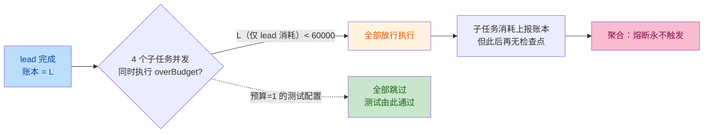

# 代码审查报告：Token 预算统一控制

- **审查日期**：2026-09-08
- **审查对象**：工作树未提交改动（相对 HEAD `8722b3ab5684c84dfc6f57ec73e1edce0457a1cf`），Token 预算统一控制功能（消费侧预算：输出封顶三档 maxTokens + 编排全程消费上限熔断）
- **需求对照**：`.trae/specs/unify-token-budget/`（spec.md / tasks.md / checklist.md）
- **测试状态**：三个目标测试类 12 + 22 + 2 = 36 用例，0 失败 0 错误（审查时实跑产出）
- **审查方式**：独立代码审查子代理（对照规格逐文件审查 + 字节码验证 + 测试实跑）

## 优点

1. **向后兼容做得干净彻底**。代码默认全 0、`putLedger` 不注入、`maxTokens>0` 才写入、`overBudget`/`ledgerListener` 对无账本场景全部 null-safe 直通（`MultiAgentGraphAgent.java:555-598`、`AgentChatCaller.java:396-404`），且用 `ContextBudgetPropertiesTest` 双用例锁死了「默认 0 = 不限」和 kebab-case 绑定。
2. **口径一致性忠实落地**。`reportUsage`（`AgentChatCaller.java:396-404`）与 `recordOkStream` 的估算口径逐字对齐（`usage.getTotalTokens()` 空判 → `LlmCallRecorder.estimateTokens(content)`），估算标记经 `K_TOKEN_ESTIMATED` 传递到降级说明，「估算 vs 真实可区分」这条 spec 要求闭环了。
3. **档位映射考虑了全部路径**。`buildSpec` 两个分支（model 有/无）都落档（`AgentChatCaller.java:572-592`）；路径 A 的注入放在 `GeneralAssistantAgent` 统一的 options 构建器上（`GeneralAssistantAgent.java:376-380`），model 为空时同样生效——这正是容易漏掉的分支，没漏。
4. **聚合降级的状态机设计细致**：`SKIPPED_RESULT` 占位与「子任务失败无结果（空）」严格区分；占位不进 `results`、只进 `skipped` 计数；聚合必发不受熔断；编排正常终态（`MultiAgentGraphAgent.java:699-728`）。
5. **熔断用例是真断言**：`times(2)).stream()` 确实能证明子任务零 LLM 调用（每次调用必经 `requestSpec.stream()`），user captor 取最后一值确实捕获的是聚合 prompt——覆盖的路径验证的是真实行为。
6. **账本对象放进 graph state 的架构担忧，实际验证过是安全的**：MysqlSaver 默认序列化器是 `SpringAIJacksonStateSerializer`（`StateGraph.DEFAULT_JACKSON_SERIALIZER`），启用 `NON_FINAL` default typing + `LaissezFaireSubTypeValidator`，`AtomicLong`/`AtomicBoolean` 均为非 final 类会带类型信息，且 Jackson 原生支持两者反序列化——检查点往返无损；续跑时 Replace 策略 + 新 input 注入也保证旧值永不被读。
7. 文档（第五节）与 HARNESS\_TODO 回写认真，遗留项（P1 聚合前分摊裁剪）如实标注。

## 问题

### Critical（必须修复）

#### C1. 熔断检查时点在并行扇出下只能看到 lead 消耗——生产默认配置下熔断永远不可能触发，功能主目标落空

- 位置：`MultiAgentGraphAgent.java:663`（唯一检查点，子任务节点起始处）、`:505`（`addEdge(NODE_LEAD, subtasks)` 四路扇出）；上报点 `AgentChatCaller.java:257/282`（仅 `call()` 成功末尾）。
- 问题：graph-core 1.1.2.2 对 `addEdge(from, List)` 扇出生成 `ParallelNode`，其 `AsyncParallelNodeAction` 用 `CompletableFuture.supplyAsync + allOf` 并发执行各分支，默认线程池 core = max(2×CPU, 4) ≥ 4（已反汇编确认；测试日志中 subtask-0/1 在 `parallel-node-action-thread-3/4` 等成对线程上同毫秒完成，实证并发）。四个子任务的 `overBudget(state)` 在**同一时刻**求值，此时账本里只有 lead 的消耗（`reportUsage` 在调用成功结束后才累加）；子任务完成后账本再涨，但之后再无任何检查点（聚合不检查）。因此熔断唯一的触发条件是**lead 单次调用消耗 ≥ orchestration-budget**。生产默认下 lead 消耗 ≤ 约 1 万 token（输入预算 4k + 输出封顶 2k），预算 60000——**永远不熔断**。
- 测试为何通过：`MultiAgentGraphAgentTest` 三个熔断用例设 `orchestration-budget=1`（必然低于 lead 消耗的退化配置），只验证了「批前已超限 → 全跳过」这一条机械路径。spec 场景「lead + **部分子任务**消耗已达上限，**剩余**子任务待执行 → 剩余短路」在当前并行拓扑下是**结构性不可达状态**——这是与计划的实质偏差，也是计划本身（spec 场景按顺序执行心智模型写就）与实现的共同问题，需要实现者明确确认。
- 佐证文档失真：`docs/guides/context-optimization.md:206` 写「超限瞬间可能多跑一个**已在途的**子任务」——实际是**整个批次**都在途、都看不到彼此消耗，文档把结构性失效淡化为竞态窗口。
- 修复方向（任选其一并同步修正文档与用例）：
  1. 子任务限并发：graph-core `ParallelNode` 支持 max-concurrency（RunnableConfig metadata 的 `MAX_CONCURRENCY_KEY`，字节码可见 Semaphore 包裹分支动作）——限 1\~2 使子任务错峰，后续检查即可见前序累计，顺带收敛并行 LLM 压力；
  2. 最彻底：熔断下沉到 `AgentChatCaller` 调用链内部，在\*\*每次 LLM roundtrip（含单次 call 的工具循环）\*\*前检查剩余额度——这同时解决「单个子任务工具循环一次烧穿剩余预算」的盲区；
  3. 链式 `lead→s0→s1→s2→s3→aggregate`（牺牲并行延迟，不推荐）。

### Important（应该修复）

#### I1. `stream()` 重载收了 `usageListener` 但从未调用——契约违背 + 同步/流式口径不一致

- 位置：`AgentChatCaller.java:447-453`（javadoc 明确承诺「成功结束后同步上报消耗」与新签名）vs `:524-527`（成功路径只有 `recordOkStream`，无 `reportUsage`；全文件 `reportUsage` 仅 `:257/:282` 两处，都在 `call()` 内）。
- 为什么重要：流式聚合路径（`streamAggregateOnce` 传入的 listener）账本永不计入聚合消耗，同步路径（`predictAggregate`）会计入——同一节点两条路径口径分裂；参数静默失效，未来任何在聚合后读取账本的逻辑都会拿到错值。测试缺口放大了问题：`AgentChatCallerTest` 只测了 `call()` 的 listener 上报，没有 stream + listener 用例（有一个就会当场抓住这个 bug）。
- 修法：在 `:526` `recordOkStream(...)` 之后补 `reportUsage(usageListener, out, usageRef.get());`，并补一条 `stream_reportsUsageToListener` 用例。

#### I2. spec 场景「部分子任务消耗后剩余跳过」无测试且不可测，checklist 验收口径与实际能力不符

- 位置：`.trae/specs/unify-token-budget/spec.md` 熔断 Scenario、`checklist.md` 第 6/7 条。
- 为什么重要：checklist 勾选的验收描述暗示「剩余子任务」语义成立，但如 C1 所析，跳过只可能是「全部子任务」或「零个子任务」，不存在部分跳过（线程池争用导致的偶然错峰除外，属非确定性行为）。合并前要么修 C1 后补部分跳过用例，要么明确把 spec/checklist 场景改为与实际拓扑一致的口径——不能让验收文档描述一个不存在的状态。

### Minor（锦上添花）

1. **续跑时账本清零 = 预算按「运行段」重置**（`MultiAgentGraphAgent.java:555-560`）。断点续跑注入全新零值账本，中断前消耗不计入，续跑可再花一整个预算。文档 5.2 已如实标注「近似口径，可接受」，且已验证序列化无损，故降为 Minor；若后续收紧，可在 `putLedger` 前读检查点旧值做种子。
2. **HARNESS\_TODO.md 混入无关改动**：除 Token 预算条目外，同一 diff 里勾选了 3 个不相关条目（角色提示词/agent 切换/多 agent 卡住）并新增 2 个 P1 条目（工具调用日志、沙箱安全校验）。未提交状态下建议提交时拆分或确认这些勾选确有其事，避免功能 commit 夹带。
3. **`maxTokensForRole`** **的** **`"lead"/"aggregator"`** **字面量**（`AgentChatCaller.java:650-658`）与 `MultiAgentGraphAgent.ROLE_LEAD/ROLE_AGGREGATOR`、`MemoryPolicy` 各自私有重复。沿用现有字面量风格可接受，建议收敛到一处常量。
4. **`ContextBudgetPropertiesTest.bindsYamlKebabCaseKeys`** **用 Map 复刻 yaml 值**而非读取真实 `application.yaml`——yaml 漂移时测试不会报警。可加一条轻量断言（classpath 加载 yaml 绑定后比对），或接受现状。

## 建议

- C1 的修复优先选方向 2（熔断下沉到 caller 的 roundtrip 粒度）：它同时消灭「并行检查时点」和「单次 call 工具循环烧穿」两个盲区，账本/上报基础设施（本次已建好且质量不错）可完全复用，改动集中在 `AgentChatCaller` 与额度传递。
- 修 C1 时把 `docs/guides/context-optimization.md:206` 的「并行竞态」段落重写为与新时点一致的描述，并让三个熔断用例至少覆盖一个「lead + 前序子任务累计超限 → 后续子任务跳过」的真实部分跳过场景（限并发后即天然可测）。
- 与计划的关系：这不是实现者偏离计划，而是 spec 场景本身隐含了「子任务间有先后可见性」的假设，与既有并行拓扑矛盾——建议把该偏差回写到 spec（增补设计决策记录），避免后续维护者再把 budget=1 的测试当有效性证据。

## 评估

**可以合并吗？** 修完再合。

**理由：** 输出封顶、配置收敛、口径标记、降级说明与文档回写质量都过关，但本次变更的标题功能——编排消费上限熔断——在默认配置下结构性不可达（C1），测试与文档给出了超出实际能力的有效性背书（I1/I2）；属于「功能损坏」而非打磨问题。C1 + I1 修复并补齐用例/文档后即可合并；若团队有意识地降级为「批前门控」语义，也必须先修正 spec/checklist/文档再合，不能带着失真验收合并。

***

## 修复记录

（审查发现的问题处置进度，修复时更新）

| 编号        | 严重度       | 结论                                          | 状态   |
| --------- | --------- | ------------------------------------------- | ---- |
| C1        | Critical  | 并行扇出下熔断检查只见 lead 消耗，生产默认配置结构性不可达            | 已修复（2026-09-08，按方向 b） |
| I1        | Important | `stream()` 未调用 `reportUsage`，流式聚合消耗不计入账本    | 已修复（2026-09-08） |
| I2        | Important | spec/checklist「部分子任务跳过」场景与实际拓扑不符            | 已修复（2026-09-08） |
| Minor 1-4 | Minor     | 续跑账本清零 / TODO 混入无关勾选 / 字面量重复 / yaml 绑定测试非真源 | 记录备查 |
| D1        | 设计决策（用户定） | 消除「代码默认 / yaml 生产值」双口径，最终实现为：`ContextBudgetProperties` 零数字（int 缺省 0），application.yaml 是全部预算数值唯一来源；全键统一 0 = 不限制（该层预算关闭，含输入侧五键——PromptBudgetAdvisor / ToolCallBudget / ContextAssemblingAdvisor 均按 ≤0 直通）；`GeneralAssistantAgent` 硬编码兜底数与 `ContextAssemblingAdvisor` 无参构造（内置 4000）一并移除。yaml 数值漂移由 `bindsApplicationYaml_productionValues`（绑定真实 yaml）拦截 | 已完成 |

**修复说明（2026-09-08）：**

- **C1（方向 b：熔断下沉到 caller 的 roundtrip 粒度）**：`AgentChatCaller` 新增 `BudgetLedger` 接口（`overBudget()` / `recordUsage(int, boolean)`）与 `BudgetExceededException`，在发起调用前与每轮 LLM roundtrip 的 usage 帧到达时检查（含单次 call 内部工具循环的每轮，超限即断流）；`MultiAgentGraphAgent` 节点句柄改造为门控（lead/子任务）与 record-only（聚合）两类，并行扇出经 `subtask-concurrency`（yaml 新键，ParallelNode 信号量）限并发错峰。相关用例：`call_ledgerPreCheckOverBudget_zeroHttp` / `call_realUsageFrame_recordsActualTokens` / `execute_partialBudgetExhaustion_skipsOnlyRemainingSubtasks`。
- **I1**：stream 路径接入同一 `BudgetLedger`——usage 帧增量记账 + 无 usage 时估算兜底，与 call 同口径。相关用例：`stream_reportsRealUsageToLedger` / `stream_noUsage_estimatedFallback`。
- **I2**：spec 增补设计决策记录（批前检查结构性盲区 → roundtrip 粒度）与「真实部分跳过」Scenario；checklist 验收条目同步更新；`docs/guides/context-optimization.md` 5.2 熔断段按新时点重写。全量回归 320 通过。

